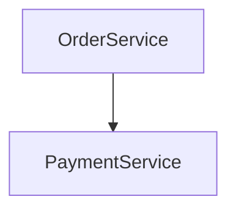
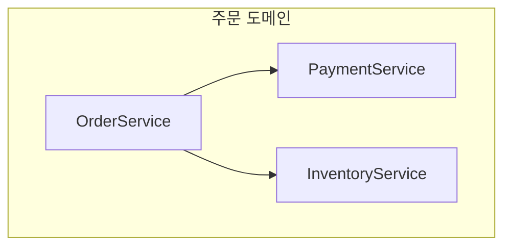
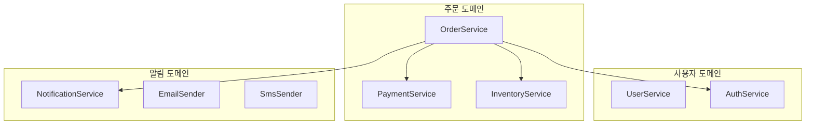

---
name: generating-architecture-views
description: Generates a structural architecture view (components, evidence-based groups, dependencies, and pairwise responsibility contrasts) from a natural-language process description, then offers to hand off to generating-zenuml-diagrams for the sequence/behavior diagram. Use when the user asks about a system's or process's structure, architecture, component responsibilities, or component relationships — including when they say a sequence diagram alone didn't make the structure clear. Do not use for sequence diagrams, call order, or runtime/behavior flow — that is generating-zenuml-diagrams's job.
---

# Generating Architecture Views

## Relationship to `generating-zenuml-diagrams`

This skill depends on `generating-zenuml-diagrams` and is not a replacement for it. This skill only produces two things — a **Components & Dependencies** view and a **Responsibility** view — and never draws a sequence/runtime-flow diagram itself. When the user also wants to see how the process actually runs, this skill hands off to `generating-zenuml-diagrams` (see "Offering the sequence diagram" below). Never edit that skill's `SKILL.md` or any file under its directory — always run it as it already exists.

## Workflow overview

1. Determine the purpose (from what's stated/implied; ask only if genuinely unclear).
2. Generate the Components & Dependencies section.
3. Generate the Responsibility section.
4. Self-check (AP-1–AP-7, AP-10, AP-11, AP-12) and fix before presenting.
5. Save the architecture view file and feedback log, and present the file link.
6. Ask whether to continue into a sequence diagram.
7. If agreed: self-check the hand-off (AP-8–AP-9), then run `generating-zenuml-diagrams`. If declined or no response: stop here.

## Step 1 — Confirm the purpose

Before generating anything, judge whether the purpose is already clear — either stated outright or clearly implied by context (e.g., "새로 합류한 팀원에게 보여주려고" implies onboarding; "OrderService 쪽에서 이상한 게 있어서 봐야 해" implies troubleshooting). If so, use that purpose and don't ask — the same "only stop for ambiguity that actually matters" judgment `generating-zenuml-diagrams` applies to structural gaps. Only when the purpose is genuinely unclear — you can't reasonably tell which of the three it is — ask before doing anything else:

```text
이 구조 뷰를 어떤 목적으로 보시나요?
1. 온보딩 — 전체 구조를 이해하고 싶다
2. 특정 문제 진단 — 특정 컴포넌트/관계에 집중하고 싶다
3. 기타 — 직접 설명
```

- A clear answer to 1/2/3 sets the purpose. For "기타" (3), ask one more question — "어떤 정보가 필요하신지 한 문장으로 알려주세요" — and wait for that answer before continuing.
- An ambiguous answer or no answer at all (the user asks something unrelated instead) is **not** treated as agreement to guess — default to **온보딩** and say so explicitly in your response (e.g., "목적을 명확히 하지 않으셔서 온보딩 기준으로 진행합니다").
- In the current scope, the confirmed purpose does not change which sections get produced — Components & Dependencies and Responsibility are always both generated (see Steps 2–3) regardless of purpose. That's exactly why this question isn't worth forcing on every request: don't ask it just to have asked it — only when you genuinely can't tell which purpose applies.
- If the description doesn't identify any components at all, don't ask about purpose — ask what process/system to diagram instead, the same way `generating-zenuml-diagrams` does when it can't identify participants.

## Step 2 — Generate Components & Dependencies

Use only components and dependencies the description explicitly states or clearly implies — never add one to make the picture feel complete. Each arrow represents a call the description directly states or implies between those exact two components — if the description only establishes a chain (A calls B, B calls C), draw A→B and B→C, never a collapsed A→C shortcut implying A calls C directly when nothing said that.

Group components with a Mermaid `subgraph` **only** when the description gives an actual signal: a shared name prefix/namespace, or an explicit layer/domain word ("주문 도메인", "인증 계층", etc.). If there is no such signal, do not create any `subgraph` — treat every component as part of one unlabeled set instead (this still counts as "one group" for Step 3's counting, it's just not drawn as a box).

Render dependencies as arrows between components. See `references/templates.md` for the exact Mermaid shape.

## Step 3 — Generate Responsibility

This section has two levels — do the group level first, then the component level:

**Group level** (only when Step 2 produced 2 or more groups): compare each unordered pair of groups that has **at least one dependency edge crossing between their members** — a group pair with no such edge gets no entry at all, the same gating the component level uses. The count equals the number of group pairs with at least one cross-group edge; the ceiling is m×(m-1)/2 only if every possible group pair happens to be connected. Each entry's "responsibility" for a group must always include the name/label the description actually gave it (e.g., "주문 도메인") — and if the description also states something about that group beyond the bare label (e.g., what kind of module boundary it is, what it's for), include that too. The rule is the same one FR-009/FR-010 already apply to components: use what the description actually says, and never guess or invent a role/purpose it didn't state. This matters most for structurally-named groups ("app 모듈", "feature 모듈") where the label alone carries no semantic content — a label-only contrast there degenerates into a tautology ("app 모듈 대 feature 모듈"), so use whatever real, stated detail is available instead of settling for that.

**Component level**: within each group from Step 2 (or the whole component set, if Step 2 made no groups), compare each unordered pair of components that are **directly connected by a dependency** in Components & Dependencies — regardless of call direction, but only pairs that actually call each other (a component is only ever compared against others in its *own* group — cross-group component pairs don't get an entry at all; that contrast already happened at the group level above). A group with e dependency edges among its components gets exactly e entries — never one for a pair that doesn't call each other, and the ceiling is n×(n-1)/2 only if every possible pair happens to call each other. Generate the pairs in first-appearance order (see `references/templates.md`) so you don't accidentally produce the same pair twice.

Each component-level entry states both components' own responsibility, as the description actually describes it — reading the two side by side is what shows the contrast, so don't append a separate summary sentence naming the difference. If the description never states one component's responsibility, write `책임이 설명에 명시되지 않음` for that component — never guess a plausible-sounding responsibility to fill the gap.

At both levels, the dependency itself is the gate: no dependency between the two components (component level), or between any member of one group and any member of the other (group level), means no entry at all — the label-grounding rule above only governs *what a compared group is allowed to say*, not *whether it gets compared*.

**Format**: every entry — group-level and component-level — puts both sides' names in bold and reflects the real dependency direction, never a neutral "vs". If exactly one direction exists, write it as "**A**는 **B**에 의존한다" (A depends on B); if the dependency runs both ways between the pair, write "**A**와 **B**는 서로 의존한다" (mutual) instead of arbitrarily picking one direction. Separate clauses with periods, never semicolons, and stop once both sides' responsibilities are stated — don't append a separate "차이: ..." summary sentence, since the two responsibility statements already show the contrast on their own — e.g. "**A**는 **B**에 의존한다: A는 <책임>. B는 <책임>."

Write every entry — group-level and component-level alike — as a fully self-contained unit: restate each side's own responsibility (or label) in full every time, never with a backreference like "위와 동일" pointing at an earlier entry. A reader looking at only one bullet, out of order, must be able to understand it without scrolling elsewhere. This also means quality must not taper off across a long list — the last entry in a 10-item group deserves the same concrete, specific contrast as the first, not a shorter, genericized one.

## Self-check before presenting

Copy this into your working notes before showing a structure view:

```text
Architecture view anti-pattern check:
- [ ] AP-1: No components beyond what the description states or clearly implies
- [ ] AP-2: No dependencies beyond what the description states or clearly implies, and no chain (A calls B, B calls C) collapsed into a shortcut edge (A→C) that skips the intermediate hop
- [ ] AP-3: No subgraph group without an explicit naming/layer/domain signal in the description
- [ ] AP-4: Each group's within-group Responsibility list has exactly one entry per pair of components that directly call each other — no entry for a non-dependent pair, no ordered-pair duplicates, no cross-group entries
- [ ] AP-5: Group-to-group entries exist only for group pairs with at least one cross-group dependency edge (zero if 1 or fewer groups, or if a pair has no such edge), and each is grounded in the group's given label plus whatever else the description actually states about that group — never a guessed role/purpose beyond what's stated
- [ ] AP-11: Every entry (group- and component-level) uses bold names and the real dependency direction ("A는 B에 의존한다", or "A와 B는 서로 의존한다" if bidirectional) instead of a neutral "vs", separates clauses with periods, never semicolons, and ends once both sides' responsibilities are stated — no separate "차이: ..." summary sentence appended
- [ ] AP-6: No guessed responsibility for a component whose responsibility isn't stated
- [ ] AP-7: No section comparing concepts that don't appear as identified components in the description
- [ ] AP-10: Every entry restates both sides in full and independently (no "위와 동일"-style backreferences), and entries don't get thinner/more generic later in a long list than earlier
- [ ] AP-12: The request has been classified (initial generation vs. regeneration vs. colliding slug) and the log write matches it — fresh Round 1, or a new round appended without touching earlier ones — and no output file or log gets written at all if Steps 2–3 never completed
```

Workflow: generate a draft → check it against AP-1 through AP-7, AP-10, AP-11, and AP-12 → if anything fails, revise → re-check → only then present the result. Don't narrate the checklist to the user; just perform it before responding.

## Output file

Don't paste the Components & Dependencies or Responsibility content into the chat response. Save it to a file and link to it instead — the same reasoning `generating-zenuml-diagrams` uses (see its `SKILL.md`, "Output file"): file links don't trigger unwanted auto-preview behavior the way Claude Artifacts do, and this repository already has a working Mermaid-preview path through VS Code.

**Where**: `.zenuml/<slug>.architecture.md`, sharing the same `<slug>` as the process's sequence diagram file (`.zenuml/<slug>.md`) if one exists — but always a distinct file. Never write into or overwrite `.zenuml/<slug>.md` from this skill; that file belongs to `generating-zenuml-diagrams`.

**Request classification**: before writing, classify the request the same way `generating-zenuml-diagrams` does — (1) *Regeneration* (a follow-up refining the architecture view just shown in this conversation) overwrites the existing `.zenuml/<slug>.architecture.md` completely; (2) *Initial generation* (a self-contained description with no existing file for this slug) creates a new file; (3) *new request with a colliding slug* (an unrelated description that happens to hash to an existing `.zenuml/<slug>.architecture.md`) appends `-2`, `-3`, … rather than overwriting; (4) if genuinely unclear which of the three this is, ask rather than guessing.

**File contents**: a `### Components & Dependencies` heading followed by its Mermaid code fence, then a `### Responsibility` heading followed by its comparison lists, in that order — no other ordering. Use `###` for both (never `##` or shallower, matching this repository's `.zenuml/` heading convention). Within Responsibility, if there are 2+ groups, a `#### 그룹 간 비교` sub-heading with the group-to-group entries comes first, followed by one `####` sub-heading per group that has at least one within-group entry; if there's only one group (or none), skip the group-to-group sub-heading and just list that group's entries directly under `### Responsibility`. A group with no directly-connected component pairs at all gets no sub-heading and no entries — don't show an empty section.

After writing, the entire chat response for this part is a relative link:

📄 [<slug> 구조 뷰](.zenuml/client-server.architecture.md)

If there is no filesystem access in the current environment, skip the file and put both sections directly in the chat response as fenced blocks instead. Skip the feedback log below too in that case — there's no file to log against.

### Architecture view feedback log

Alongside `.zenuml/<slug>.architecture.md`, every successfully generated or regenerated architecture view gets a feedback log at `.zenuml/log/<slug>.architecture.md` — same slug, `log/` subdirectory, mirroring the mechanism `generating-zenuml-diagrams` already uses for its own output (see its `SKILL.md`, "Diagram feedback log"). This is already covered by the `.zenuml/` `.gitignore` entry, so it needs no gitignore entry of its own.

**What goes in the `**Request**:` field**: not just the single message that immediately triggered this round. Gather every turn since the previous round (or, for Round 1, since the conversation about this architecture view started) that actually contributed to what got built — including the purpose-confirmation exchange from Step 1, if that's how this round's scope was pinned down. Drop anything unrelated (small talk, tangents), and lightly edit the rest into one coherent entry rather than pasting a raw transcript.

**On initial generation** (or a new request with a colliding slug), create the log fresh:

````markdown
## Round 1 — <ISO date>
**Request**: <the user's request, verbatim or lightly summarized>

**Response**:
<the generated Components & Dependencies and Responsibility content, exactly as written to `.zenuml/<slug>.architecture.md`>
````

**On regeneration**, append a new round to the existing `.zenuml/log/<slug>.architecture.md` — never rewrite or delete earlier rounds, no matter how many rounds accumulate:

````markdown
## Round N — <ISO date>
**Request**: <this round's request>

**Response**:
<the regenerated Components & Dependencies and Responsibility content>
````

Don't summarize, analyze, or prune this log's content, ever — it exists purely so a human can read it later and decide what's worth acting on. If Steps 2–3 never completed (the request ended in a clarifying question instead of a finished architecture view), don't create either the output file or the log file — there's nothing to save yet.

**Citing a feedback log elsewhere**: `.zenuml/log/` is gitignored by default. If some other piece of work actually reads and cites a specific `.zenuml/log/<slug>.architecture.md` as a source, stage that one file right then with `git add -f .zenuml/log/<slug>.architecture.md` — nothing else in `.zenuml/` gets staged automatically, and uncited logs stay untracked.

## Out-of-scope requests

- **Class diagrams, deployment diagrams, or any non-Components & Dependencies/Responsibility structural view**: say this skill only produces those three things; it doesn't attempt a workaround.
- **Analyzing an actual codebase to produce the view**: this skill's self-check (AP-1–AP-7) only verifies that a view doesn't exceed a *given* description — it has no way to verify that a description faithfully covers an entire codebase. So this skill still takes only a natural-language description as input, not raw code or a repository, the same restriction `generating-zenuml-diagrams` has. If real code is available, read it yourself first (directly, or via Explore/Grep/gh), distill what you find into a description that cites concrete evidence (file paths, exact identifiers, commit/PR references), then pass that description in as normal.
- **Comparing concepts that aren't components identified in the description** (e.g., "Controller vs Application 패턴이 뭐가 다른가요?" with no such components in the input): say Responsibility only compares components actually identified from the description, not general concepts or patterns.

### Example: minimal request

Input: "OrderService는 주문을 생성하고, PaymentService는 결제를 담당하며, OrderService가 PaymentService를 호출한다. 이 시스템의 구조를 보여줘." Purpose confirmed as 온보딩.

Generated file (`.zenuml/<slug>.architecture.md`, not pasted into the chat response):

````markdown
### Components & Dependencies



### Responsibility

- **OrderService**는 **PaymentService**에 의존한다: OrderService는 주문을 생성한다. PaymentService는 결제를 담당한다.
````

No `subgraph` because the description gave no grouping signal; no third component invented.

### Example: request with a group

Input: "OrderService, PaymentService, InventoryService가 모두 '주문 도메인' 그룹에 속하고, OrderService가 나머지 둘을 호출한다."

Generated file (3 components in one group, but only 2 dependency edges → 2 entries; the pair that never calls each other gets none):

````markdown
### Components & Dependencies



### Responsibility

#### 주문 도메인

- **OrderService**는 **PaymentService**에 의존한다: OrderService는 주문을 생성한다. PaymentService는 결제를 담당한다.
- **OrderService**는 **InventoryService**에 의존한다: OrderService는 주문을 생성한다. InventoryService는 [설명에 명시된 책임].
````

PaymentService and InventoryService never call each other, so no entry is generated for that pair even though they share a group. There is only one group, so no group-to-group comparison appears either.

### Example: request with 3+ groups

Input: "'사용자 도메인'에는 UserService, AuthService가 있고, '주문 도메인'에는 OrderService, PaymentService, InventoryService가 있고, '알림 도메인'에는 NotificationService, EmailSender, SmsSender가 있어. OrderService가 PaymentService, InventoryService, AuthService, NotificationService를 호출해."

Generated file (3 groups, but group-to-group entries only where a cross-group dependency edge actually exists — 사용자 도메인↔주문 도메인 and 주문 도메인↔알림 도메인 are connected, 사용자 도메인↔알림 도메인 is not, so 2 group-level entries, not 3×2/2=3 — plus within-group entries only where a dependency edge actually exists — 0+2+0=2 total):

````markdown
### Components & Dependencies



### Responsibility

#### 그룹 간 비교

- **주문 도메인**는 **사용자 도메인**에 의존한다: 주문 도메인. 사용자 도메인.
- **주문 도메인**는 **알림 도메인**에 의존한다: 주문 도메인. 알림 도메인.

#### 주문 도메인

- **OrderService**는 **PaymentService**에 의존한다: 책임이 설명에 명시되지 않음. 책임이 설명에 명시되지 않음.
- **OrderService**는 **InventoryService**에 의존한다: 책임이 설명에 명시되지 않음. 책임이 설명에 명시되지 않음.
````

사용자 도메인과 알림 도메인 사이에는 서로 호출하는 컴포넌트가 하나도 없으므로(각각 주문 도메인의 OrderService와만 연결됨) 그 두 그룹 간 비교 항목 자체가 생성되지 않는다. 마찬가지로 사용자 도메인(UserService, AuthService)과 알림 도메인(NotificationService, EmailSender, SmsSender)은 그룹 내부에서 서로 호출하는 관계가 설명에 전혀 없으므로 — PaymentService와 InventoryService도 같은 이유로 — 어떤 컴포넌트 레벨 항목도 생성되지 않고, 해당 그룹의 `####` 하위 제목 자체가 나타나지 않는다.

Note what's absent: OrderService calls AuthService and NotificationService directly, but there is no component-level entry for either pair anywhere — those are different groups, so the only contrast drawn between them happens at the group level ("주문 도메인은 사용자 도메인에 의존한다", etc.), never at the component level. The group-level entries also don't claim anything beyond each domain's own name.

## Offering the sequence diagram

Once the architecture view file (or chat text, if no filesystem) has been presented, ask — in the same response, right after the file link:

```text
이 구조를 바탕으로 시퀀스 다이어그램도 만들까요?
```

Skip this question entirely if Steps 2–3 never completed (you asked a clarifying question about the target process instead) — there is no architecture view to build on yet.

### If the user agrees

Build a single enriched natural-language process description that combines: the user's original description, the components/groups/dependencies from Components & Dependencies, and the responsibilities from Responsibility. Pass that description to `generating-zenuml-diagrams` exactly as if the user had typed it themselves, and let that skill run its own complete workflow (request classification, generation rules, anti-pattern self-check, output file, feedback log) untouched — don't reimplement or shortcut any part of it here.

Carry the current environment's file-availability status into that run too: if this environment has no filesystem access, `generating-zenuml-diagrams` should fall back to its own chat-text output (its `SKILL.md`, "Output file") rather than attempting a file write.

### If the user declines or doesn't respond clearly

Do not run `generating-zenuml-diagrams`. Do not ask again in this response, and don't bring it up unprompted in a later one — end with the architecture view alone. If the user wants the sequence diagram later, they'll ask for it (directly, or by invoking either skill again).

## Self-check for the hand-off

Add these to the same working checklist before offering or running the hand-off:

```text
- [ ] AP-8: No sequence/Runtime-Flow diagram drawn by this skill itself
- [ ] AP-9: The hand-off question was asked (if a structure view was produced), and generating-zenuml-diagrams was not run without explicit agreement
```

### Example: agreement

Continuing the minimal-request example above, if the user replies "응, 만들어줘": run `generating-zenuml-diagrams` with the description "OrderService가 주문을 생성하고 PaymentService를 호출해 결제를 처리한다. OrderService는 주문 생성을, PaymentService는 결제 처리를 담당한다." and present its resulting `.zenuml/<slug>.md` link right after the architecture view link.

### Example: decline

If the user replies "아니 됐어" (or asks an unrelated question instead): respond with nothing further about the sequence diagram — the architecture view link from the previous step is the complete answer.

## Scale control

Never add a component, group, or dependency beyond what Step 2 already restricts you to — this is also what keeps Responsibility bounded. The group level grows with the number of group pairs actually connected by a cross-group dependency edge, not automatically with group count — its ceiling is m×(m-1)/2 only in the (uncommon) case where every possible group pair happens to be connected. The component level likewise grows with the number of actual dependency edges in a group, not automatically with group size — its ceiling is n×(n-1)/2 only in the (uncommon) case where every possible pair happens to call each other. Don't "helpfully" split a large group into smaller invented ones to reduce that count either; grouping still has to come from the description's own signals, and don't invent extra dependencies just to change the count in either direction.

If a group's described dependencies are dense enough that the comparison count will be noticeably long (as a rule of thumb, a group with 8+ components where most pairs call each other can approach 28+ entries), say so before or alongside the Responsibility section — e.g., "이 그룹은 컴포넌트 간 호출 관계가 많아 책임 비교 항목이 28개로 꽤 깁니다." Still generate the full list; don't refuse or truncate it.

### Example: large-group warning

Input describing 8 components all in one group, where the description states every pair calls each other (fully connected). Response includes: "PaymentDomain 그룹은 컴포넌트 간 호출 관계가 촘촘해 Responsibility 섹션에 28개(8×7/2) 항목이 생성됩니다 — 결과가 길 수 있습니다." followed by the full Components & Dependencies and all 28 Responsibility entries. (If the same 8 components only had a handful of described calls, the entry count would just be that handful, not 28 — the warning and full count only apply when the description itself is this densely connected.)
