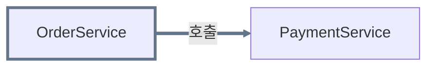

# Generating Architecture Views

## Relationship to `generating-zenuml-diagrams`

This skill depends on `generating-zenuml-diagrams` and is not a replacement for it. This skill only produces three things — **Dependency**, **Responsibility**, and **Collaboration** — and never draws a sequence/runtime-flow diagram itself. When the user also wants to see how the process actually runs, this skill hands off to `generating-zenuml-diagrams` (see "Offering the sequence diagram" below). Never edit that skill's `SKILL.md` or any file under its directory — always run it as it already exists.

## Workflow overview

1. Determine the purpose (from what's stated/implied; ask only if genuinely unclear).
2. Generate the Dependency section (components, groups, relationship-labeled and color-coded diagram, hyperlinks).
3. Generate the Responsibility section (per-group and per-element, abstract + concrete).
4. Generate the Collaboration section (dependency-gated group and element entries, with multi-target consolidation).
5. Self-check (AP-1–AP-14) and fix before presenting.
6. Save the architecture view file and feedback log, and present the file link.
7. Ask whether to continue into a sequence diagram.
8. If agreed: self-check the hand-off (AP-15–AP-16), then run `generating-zenuml-diagrams`. If declined or no response: stop here.

## Step 1 — Confirm the purpose

Before generating anything, judge whether the purpose is already clear — either stated outright or clearly implied by context (e.g., "새로 합류한 팀원에게 보여주려고" implies onboarding; "OrderService 쪽에서 이상한 게 있어서 봐야 해" implies troubleshooting). If so, use that purpose and don't ask — the same "only stop for ambiguity that actually matters" judgment `generating-zenuml-diagrams` applies to structural gaps. Only when the purpose is genuinely unclear — you can't reasonably tell which of the three it is — ask before doing anything else:

```text
이 구조 뷰를 어떤 목적으로 보시나요?
1. 온보딩 — 전체 구조를 이해하고 싶다
2. 특정 문제 진단 — 특정 컴포넌트/관계에 집중하고 싶다
3. 기타 — 직접 설명
```

- A clear answer to 1/2/3 sets the purpose. For "기타" (3), ask one more question — "어떤 정보가 필요하신지 한 문장으로 알려주세요" — and wait for that answer before continuing.
- An ambiguous answer or no answer at all (the user asks something unrelated instead) is **not** treated as agreement to guess — default to **온보딩** and say so explicitly in your response (e.g., "목적을 명확히 하지 않으셔서 온보딩 기준으로 진행합니다").
- In the current scope, the confirmed purpose does not change which sections get produced — Dependency, Responsibility, and Collaboration are always all three generated (see Steps 2–4) regardless of purpose. That's exactly why this question isn't worth forcing on every request: don't ask it just to have asked it — only when you genuinely can't tell which purpose applies.
- If the description doesn't identify any components at all, don't ask about purpose — ask what process/system to diagram instead, the same way `generating-zenuml-diagrams` does when it can't identify participants.

## Step 2 — Generate Dependency

Use only components and dependencies the description explicitly states or clearly implies — never add one to make the picture feel complete. Each arrow represents a relationship the description directly states or implies between those exact two components — if the description only establishes a chain (A calls B, B calls C), draw A→B and B→C, never a collapsed A→C shortcut implying A relates to C directly when nothing said that.

Group components with a Mermaid `subgraph` **only** when the description gives an actual signal: a shared name prefix/namespace, or an explicit layer/domain word ("주문 도메인", "인증 계층", etc.). If there is no such signal, do not create any `subgraph` — treat every component as part of one unlabeled set instead (this still counts as "one group" for Steps 3–4, it's just not drawn as a box).

**Diagram shape**: `flowchart LR` overall (groups arranged left-to-right), with `direction TB` inside each `subgraph` (members arranged top-to-bottom), and a fixed `%%{init}%%` styling block controlling curve, spacing, and cluster-label typography. See `references/templates.md` for the exact block to copy.

**Relationship labels**: label every arrow with the nature of the relationship as the description states or clearly implies it (e.g., 호출, 타입 참조, 선언 참조, 화면·타입 참조— this vocabulary is open-ended, not a fixed enum). If the description doesn't specify a relationship's nature, label it with the generic default "호출" rather than guessing a more specific nature that wasn't stated.

**Node and edge coloring**: give every node a border-color class (`classDef` + `class`) so it's visually distinguishable, and color every arrow leaving that node the same way via `linkStyle` (see `references/templates.md` for the fixed palette and the exact syntax). Name each class descriptively after the node's role (e.g. `navHostNode`, not `color3`). Sibling nodes that never need individual distinction anywhere in the diagram — same group, same relationship nature, no edges of their own — may share one class instead of each getting a unique color; nodes that originate at least one edge, or that play a individually-notable role, should get their own class.

**Hyperlinks**: attach a `click NodeName "target" "label"` directive to every node whose real location the description establishes (see "Hyperlink resolution" below for how `target` is determined). Skip `click` entirely for a node with no resolvable target — don't invent one.

If at least one `click` directive points at a local file path, add this note directly under the diagram (adapt the wording, keep the meaning):

```text
> 참고: 위 다이어그램 노드에는 `click` 지시어로 해당 소스 파일 경로를 연결해 두었습니다. 다만 VS Code 마크다운 미리보기의 Mermaid 렌더러는 보안상 로컬 파일로의 클릭 이동을 지원하지 않을 수 있습니다. 이 경우 아래 Responsibility 섹션의 마크다운 링크를 이용합니다.
```

Skip this note if every `click` target is a URL (browsers and GitHub-style Markdown renderers follow `click` URLs fine), or if no node has a resolvable target at all.

### Hyperlink resolution

Applies identically here (as `click`) and in Responsibility/Collaboration (as a Markdown link on the bold name) — resolve once per group/element and reuse the same target in both places:

1. **Local root project**: if the description gives (or clearly implies) a real file/folder path inside the project this skill is running against, link to that path, relative to `.zenuml/` (e.g. a component whose file lives at `app/src/.../Foo.kt` becomes `../app/src/.../Foo.kt`). A group links to the common parent folder shared by its members' paths (e.g. `../app/`) when one is evident.
2. **Web-hosted repository**: if the description gives a repository URL (instead of, or alongside, local paths), link to that file's URL. A group links to the folder's URL.
3. **Neither**: if the description gives no real location for a group or element, leave its name as plain text — don't fabricate a path or URL.

This skill never derives these targets itself by reading or searching the codebase (FR-022 still applies) — it only carries forward locations the description already states as evidence. If the user wants the description built from a real codebase first, point them to "Out-of-scope requests" below.

## Step 3 — Generate Responsibility

No pairwise comparison here — every group and every element gets its own two-part entry, except parallel sibling elements that qualify for consolidation below (see "Parallel-sibling consolidation"):

- <strong>책임 (추상)</strong>: one sentence, the high-level responsibility, in your own words but grounded in what the description says.
- <strong>역할 (구체)</strong>: a more concrete sentence citing the actual names/behaviors the description mentions (specific method calls, fields, sub-parts) — this is what makes the entry more than a restatement of the abstract line. Wrap every cited code-level identifier (class/function/property/enum-case name) in backtick code spans (`` `NiaAppState` ``, `` `navigateToTopic()` ``) — never leave a real identifier as bare prose.

Order: `#### 그룹의 책임` first (skip this subsection entirely if there are no groups), then `#### 요소의 책임` for every element. Each bullet's heading is the group/element's bold name, hyperlinked per "Hyperlink resolution" above.

**Bold markup**: use `<strong>...</strong>` HTML tags for every bold element in Responsibility and Collaboration — names and field labels (책임 (추상), 역할 (구체), 책임의 경계, 분리 이유 & 합리성 평가, 내가 할 수 있는 질문) alike — never markdown `**...**`. This matches this repository's `.zenuml/` convention and renders reliably even when the bold text wraps a Markdown link (`<strong>[이름](경로)</strong>`).

If the description doesn't give enough to write one of the two levels, write `설명에 명시되지 않음` for that level specifically — don't invent a plausible-sounding responsibility or role, and don't skip the level, since a level being empty is itself relevant information (compare Step 2's "no components beyond the description" rule).

### Parallel-sibling consolidation

When **3 or more** elements share the same group and play a parallel structural role — each fills the same kind of slot relative to a common relationship (e.g., each is its own route-registration contract called the same way by the same host, each is its own channel-sender implementation) — and none of them carries a responsibility genuinely different in kind from the others (differing only in name or implementation specifics, like which identifier it exposes, doesn't count), combine them into one entry instead of one per element. Head the entry with every member's name, each individually hyperlinked, joined with commas (e.g. `<strong>[A](path)</strong>, <strong>[B](path)</strong>, <strong>[C](path)</strong>`). 책임 (추상) becomes one shared sentence describing that parallel role; 역할 (구체) must still cite each member's own specific identifiers/behavior — consolidating the entry never means dropping any member's individual evidence.

If any member actually carries a responsibility or relationship the others don't (not just a different name — a real difference in kind), exclude that member from the combined entry and give it its own individual entry instead. Fewer than 3 qualifying siblings, or any real difference in kind of role, means no consolidation — list each individually as usual.

This reuses the exact same threshold and judgment as Step 4's "Multi-target consolidation" for Collaboration — don't invent a second mechanism.

## Step 4 — Generate Collaboration

This section holds every entry for a pair (or, per "Multi-target consolidation" below, a source and a consolidated set of targets) with a **real dependency between them** — no dependency, no entry, at either level below.

**Group level** (only when Step 2 produced 2 or more groups): one entry per unordered pair of groups with **at least one dependency edge crossing between their members**. A group pair with no such edge gets no entry. Ground each side's identity in the name/label the description actually gave that group (plus anything else the description states about it beyond the bare label) — never a guessed role or purpose. This matters most for structurally-named groups ("app 모듈", "feature 모듈") where the label alone carries no semantic content.

**Element level**: one entry per unordered pair of elements **directly connected by a dependency**, regardless of whether the two elements are in the same group or different groups — element-level entries are not restricted to within-group pairs; a cross-group edge gets both an element-level entry here and contributes to that group pair's group-level entry above. Generate entries in first-appearance order (source nodes in the order they first appear in Dependency, then each source's targets in the order their edges appear) so you don't accidentally produce the same pair twice.

**Format**: every entry — group-level and element-level — puts every name involved in `<strong>...</strong>` and states the real dependency direction as the entry's opening line, never a neutral "vs": <strong>A</strong>는 <strong>B</strong>에 의존한다 for a one-way dependency, or <strong>A</strong>와 <strong>B</strong>는 서로 의존한다 if the dependency runs both ways. Every name in that opening line is hyperlinked per "Hyperlink resolution" above whenever a target resolves for it — the same requirement Step 3 applies to Responsibility headings, reusing the identical target already resolved for that group/element (plain `<strong>` text with no link when no target resolves). This applies equally at the element level, not just the group level — a long list of element-level entries is not an exemption. Each entry then has three sub-parts, all required, and each sub-part is its own `<strong>` heading bullet followed by a **nested** bullet list of 2–4 short, concrete points — never a single inline "레이블: 문장1. 문장2." paragraph:

- <strong>책임의 경계</strong>
  - what one side is responsible for
  - what the other side is responsible for
  - where responsibility crosses from one to the other
- <strong>분리 이유 & 합리성 평가</strong>
  - why this wasn't merged into one thing
  - whether that separation still holds up
- <strong>내가 할 수 있는 질문</strong>
  - a short list of questions worth re-asking when reviewing this boundary later (2–3 items)

Wrap every cited code-level identifier inside these nested bullets in backticks, the same rule as Step 3's 역할 (구체) — e.g. "`app`은 어떤 목적지가 존재하는지 결정한다" rather than a bare "app은 ...". This plain-backtick, no-bold-no-link treatment applies **only inside the nested sub-bullets** (책임의 경계/분리 이유 & 합리성 평가/내가 할 수 있는 질문) when a group or element that already has its own `<strong>[이름](경로)</strong>` heading elsewhere in this file is mentioned again there — it does **not** apply to the entry's opening line (<strong>A</strong>는 <strong>B</strong>에 의존한다), which always keeps its own `<strong>` name and hyperlink per the Format rule above, at both the group and element level.

Write every entry as a fully self-contained unit — restate both sides' context in full each time, never a backreference like "위와 동일". Quality shouldn't taper off across a long list.

### Multi-target consolidation

When one source depends on **3 or more** targets that all share the same group **and** the same relationship nature **and** play a parallel structural role relative to that source — each fills the same kind of slot in the pattern (e.g., each is an individual channel sender, each is a route-registration contract for its own feature) — don't create one entry per target — collapse them into a single entry whose target side is a descriptive collective phrase for the set (e.g. "feature 내비게이션 요소들"), not each name spelled out. This is this format's scale-control mechanism, replacing the old exhaustive-pairwise approach — see "Scale control" below.

Targets that each have their own edges elsewhere in the diagram, or their own distinct wording in Responsibility (e.g. different function names), still qualify for this — a difference that's just *which name/implementation fills the same role* is not a reason to exclude a target. Only exclude a target when it actually carries a responsibility or relationship the others don't (a real difference in kind, not just a different name) — that target keeps its own individual entry instead of being folded into the collective phrase.

If the targets number 2 or fewer, or belong to different groups, or differ in relationship nature, list each one by name instead (joined with "와"/"과" for two) — don't consolidate.

## Self-check before presenting

Copy this into your working notes before showing a structure view:

```text
Architecture view anti-pattern check:
- [ ] AP-1: No components beyond what the description states or clearly implies
- [ ] AP-2: No dependencies beyond what the description states or clearly implies, and no chain (A calls B, B calls C) collapsed into a shortcut edge (A→C) that skips the intermediate hop
- [ ] AP-3: No subgraph group without an explicit naming/layer/domain signal in the description
- [ ] AP-4: Every arrow has a relationship-nature label grounded in the description, or the "호출" default when the description doesn't specify one — never a guessed specific nature
- [ ] AP-5: Every node has a color class, every edge is colored to match its source node, and siblings only share a class when none of them is individually distinguished elsewhere
- [ ] AP-6: Every group and every element has both 책임(추상) and 역할(구체) — "설명에 명시되지 않음" where the description doesn't support one, never a guess; every code-level identifier cited in 역할(구체) is wrapped in backticks
- [ ] AP-6b: Responsibility parallel-sibling consolidation was applied only where the condition holds (3+ elements, same group, parallel structural role, no member with a genuinely different kind of role) — the combined heading lists and hyperlinks every member, 역할(구체) still cites each member's own evidence, and a member with a real difference in kind was excluded and given its own entry instead
- [ ] AP-7: Group-level Collaboration entries exist only for group pairs with at least one cross-group dependency edge (zero if 1 or fewer groups)
- [ ] AP-8: Element-level Collaboration entries exist only for element pairs with a direct dependency edge (same-group or cross-group both count) — no entry for a non-dependent pair
- [ ] AP-9: Collaboration multi-target consolidation was applied only where the condition holds (3+ targets, same group, same relationship nature, parallel structural role — individual edges or distinct Responsibility wording don't block it by themselves) — not applied where it doesn't (2 or fewer, mixed groups, mixed nature, or a target with a genuinely different kind of role, which stays its own entry)
- [ ] AP-10: Every Collaboration entry uses `<strong>` names, the real dependency direction (<strong>A</strong>는 <strong>B</strong>에 의존한다, or 서로 의존한다 if bidirectional), all three of 책임의 경계/분리 이유 & 합리성 평가/내가 할 수 있는 질문 each as a `<strong>` heading with its own nested bullet list (not an inline paragraph), and backticks around every cited code-level identifier
- [ ] AP-11: No section comparing concepts that don't appear as identified groups/elements in the description
- [ ] AP-12: Every entry (Responsibility and Collaboration alike) restates its content in full and independently (no "위와 동일"-style backreferences), and entries don't get thinner/more generic later in a long list than earlier
- [ ] AP-13: Every hyperlink (both `click` and Markdown links) matches the resolution rule — local relative path, repo URL, or no link at all — and none is fabricated beyond what the description gives as evidence; AND every group/element with a resolved target is linked consistently everywhere its bold name appears as a heading or entry-opening name — Responsibility heading, Collaboration group-level opening line, and Collaboration element-level opening line all carry the same link (spot-check the element-level Collaboration entries specifically, since they're the most numerous and the easiest place for a link to silently go missing)
- [ ] AP-14: The request has been classified (initial generation vs. regeneration vs. colliding slug) and the log write matches it — fresh Round 1, or a new round appended without touching earlier ones — and no output file or log gets written at all if Steps 2–4 never completed
```

Workflow: generate a draft → check it against AP-1 through AP-14 → if anything fails, revise → re-check → only then present the result. Don't narrate the checklist to the user; just perform it before responding.

## Output file

Don't paste the Dependency, Responsibility, or Collaboration content into the chat response. Save it to a file and link to it instead — the same reasoning `generating-zenuml-diagrams` uses (see its `SKILL.md`, "Output file"): file links don't trigger unwanted auto-preview behavior the way Claude Artifacts do, and this repository already has a working Mermaid-preview path through VS Code.

**Where**: `.zenuml/<slug>.architecture.md`, sharing the same `<slug>` as the process's sequence diagram file (`.zenuml/<slug>.md`) if one exists — but always a distinct file. Never write into or overwrite `.zenuml/<slug>.md` from this skill; that file belongs to `generating-zenuml-diagrams`.

**Request classification**: before writing, classify the request the same way `generating-zenuml-diagrams` does — (1) *Regeneration* (a follow-up refining the architecture view just shown in this conversation) overwrites the existing `.zenuml/<slug>.architecture.md` completely; (2) *Initial generation* (a self-contained description with no existing file for this slug) creates a new file; (3) *new request with a colliding slug* (an unrelated description that happens to hash to an existing `.zenuml/<slug>.architecture.md`) appends `-2`, `-3`, … rather than overwriting; (4) if genuinely unclear which of the three this is, ask rather than guessing.

**File contents**: a `### Dependency` heading followed by its Mermaid code fence (and the click-caveat note, if applicable), then `### Responsibility`, then `### Collaboration`, in that order — no other ordering. Use `###` for all three (never `##` or shallower, matching this repository's `.zenuml/` heading convention). Within Collaboration, `#### 그룹 간 비교` (if 2+ groups) comes before `#### 요소 간 비교`.

After writing, the entire chat response for this part is a relative link:

📄 [<slug> 구조 뷰](.zenuml/client-server.architecture.md)

If there is no filesystem access in the current environment, skip the file and put all three sections directly in the chat response as fenced/plain blocks instead. Skip the feedback log below too in that case — there's no file to log against.

### Architecture view feedback log

Alongside `.zenuml/<slug>.architecture.md`, every successfully generated or regenerated architecture view gets a feedback log at `.zenuml/log/<slug>.architecture.md` — same slug, `log/` subdirectory, mirroring the mechanism `generating-zenuml-diagrams` already uses for its own output (see its `SKILL.md`, "Diagram feedback log"). This is already covered by the `.zenuml/` `.gitignore` entry, so it needs no gitignore entry of its own.

**What goes in the `**Request**:` field**: not just the single message that immediately triggered this round. Gather every turn since the previous round (or, for Round 1, since the conversation about this architecture view started) that actually contributed to what got built — including the purpose-confirmation exchange from Step 1, if that's how this round's scope was pinned down. Drop anything unrelated (small talk, tangents), and lightly edit the rest into one coherent entry rather than pasting a raw transcript.

**On initial generation** (or a new request with a colliding slug), create the log fresh:

````markdown
## Round 1 — <ISO date>
**Request**: <the user's request, verbatim or lightly summarized>

**Response**:
<the generated Dependency, Responsibility, and Collaboration content, exactly as written to `.zenuml/<slug>.architecture.md`>
````

**On regeneration**, append a new round to the existing `.zenuml/log/<slug>.architecture.md` — never rewrite or delete earlier rounds, no matter how many rounds accumulate:

````markdown
## Round N — <ISO date>
**Request**: <this round's request>

**Response**:
<the regenerated Dependency, Responsibility, and Collaboration content>
````

Don't summarize, analyze, or prune this log's content, ever — it exists purely so a human can read it later and decide what's worth acting on. If Steps 2–4 never completed (the request ended in a clarifying question instead of a finished architecture view), don't create either the output file or the log file — there's nothing to save yet.

**Citing a feedback log elsewhere**: `.zenuml/log/` is gitignored by default. If some other piece of work actually reads and cites a specific `.zenuml/log/<slug>.architecture.md` as a source, stage that one file right then with `git add -f .zenuml/log/<slug>.architecture.md` — nothing else in `.zenuml/` gets staged automatically, and uncited logs stay untracked.

## Out-of-scope requests

- **Class diagrams, deployment diagrams, or any non-Dependency/Responsibility/Collaboration structural view**: say this skill only produces those three things; it doesn't attempt a workaround.
- **Analyzing an actual codebase to produce the view**: this skill's self-check only verifies that a view doesn't exceed a *given* description — it has no way to verify that a description faithfully covers an entire codebase. So this skill still takes only a natural-language description as input, not raw code or a repository, the same restriction `generating-zenuml-diagrams` has. If real code is available, read it yourself first (directly, or via Explore/Grep/gh), distill what you find into a description that cites concrete evidence (file paths, exact identifiers, repository URLs, commit/PR references — this evidence is also what "Hyperlink resolution" above needs), then pass that description in as normal.
- **Comparing concepts that aren't groups/elements identified in the description** (e.g., "Controller vs Application 패턴이 뭐가 다른가요?" with no such components in the input): say Collaboration only compares groups/elements actually identified from the description, not general concepts or patterns.

### Example: minimal request

Input: "OrderService는 주문을 생성하고, PaymentService는 결제를 담당하며, OrderService가 PaymentService를 호출한다. 이 시스템의 구조를 보여줘." Purpose confirmed as 온보딩. No file paths or URLs given, so no hyperlinks are attached.

Generated file (`.zenuml/<slug>.architecture.md`, not pasted into the chat response):

````markdown
### Dependency



### Responsibility

#### 요소의 책임

- <strong>OrderService</strong>
  - <strong>책임 (추상)</strong>: 주문 생성을 담당한다.
  - <strong>역할 (구체)</strong>: 주문을 생성하는 처리를 수행한다.
- <strong>PaymentService</strong>
  - <strong>책임 (추상)</strong>: 결제를 담당한다.
  - <strong>역할 (구체)</strong>: 결제 처리를 수행한다.

### Collaboration

#### 요소 간 비교

- <strong>OrderService</strong>는 <strong>PaymentService</strong>에 의존한다.
  - <strong>책임의 경계</strong>
    - `OrderService`는 주문 생성을 책임진다.
    - `PaymentService`는 결제 처리를 책임진다.
    - 경계는 `OrderService`가 결제가 필요한 시점에 `PaymentService`를 호출하는 지점이다.
  - <strong>분리 이유 & 합리성 평가</strong>
    - 주문 생성과 결제 처리를 하나로 합치지 않아 각자의 변경 이유를 분리한다.
    - 두 책임이 서로 다른 이유로 바뀔 수 있다면 합리적인 분리다.
  - <strong>내가 할 수 있는 질문</strong>
    - `OrderService`가 결제 처리 세부사항까지 알고 있지는 않은가?
    - `PaymentService`가 주문 생성 로직에 역으로 의존하고 있지는 않은가?
````

No `subgraph` because the description gave no grouping signal. Only one component originates an edge (OrderService), so only one color class is needed. No `click` directives or Markdown links anywhere, since the description gave no real file paths or URLs — nothing is fabricated to fill that gap. See `references/examples.md` for fuller examples covering groups, multi-target consolidation, and all three hyperlink modes.

## Offering the sequence diagram

Once the architecture view file (or chat text, if no filesystem) has been presented, ask — in the same response, right after the file link:

```text
이 구조를 바탕으로 시퀀스 다이어그램도 만들까요?
```

Skip this question entirely if Steps 2–4 never completed (you asked a clarifying question about the target process instead) — there is no architecture view to build on yet.

### If the user agrees

Build a single enriched natural-language process description that combines: the user's original description, the components/groups/dependencies from Dependency, and the responsibilities from Responsibility. Pass that description to `generating-zenuml-diagrams` exactly as if the user had typed it themselves, and let that skill run its own complete workflow (request classification, generation rules, anti-pattern self-check, output file, feedback log) untouched — don't reimplement or shortcut any part of it here.

Carry the current environment's file-availability status into that run too: if this environment has no filesystem access, `generating-zenuml-diagrams` should fall back to its own chat-text output (its `SKILL.md`, "Output file") rather than attempting a file write.

### If the user declines or doesn't respond clearly

Do not run `generating-zenuml-diagrams`. Do not ask again in this response, and don't bring it up unprompted in a later one — end with the architecture view alone. If the user wants the sequence diagram later, they'll ask for it (directly, or by invoking either skill again).

## Self-check for the hand-off

Add these to the same working checklist before offering or running the hand-off:

```text
- [ ] AP-15: No sequence/Runtime-Flow diagram drawn by this skill itself
- [ ] AP-16: The hand-off question was asked (if a structure view was produced), and generating-zenuml-diagrams was not run without explicit agreement
```

### Example: agreement

Continuing the minimal-request example above, if the user replies "응, 만들어줘": run `generating-zenuml-diagrams` with the description "OrderService가 주문을 생성하고 PaymentService를 호출해 결제를 처리한다. OrderService는 주문 생성을, PaymentService는 결제 처리를 담당한다." and present its resulting `.zenuml/<slug>.md` link right after the architecture view link.

### Example: decline

If the user replies "아니 됐어" (or asks an unrelated question instead): respond with nothing further about the sequence diagram — the architecture view link from the previous step is the complete answer.

## Scale control

Never add a component, group, or dependency beyond what Step 2 already restricts you to (FR-011) — this is the first line of defense against an unwieldy Collaboration section. On top of that, multi-target consolidation (Step 4) is this format's dedicated scale-control mechanism: a source with many same-group, same-nature targets collapses to one entry instead of growing linearly with target count. Don't "helpfully" split a large group into smaller invented ones to reduce a count, and don't invent extra dependencies just to change a count in either direction.

If Collaboration is still going to be noticeably long even after consolidation (as a rule of thumb, a densely-connected group of 8+ elements can still produce many individual entries once each pair that doesn't qualify for consolidation is counted), say so before or alongside the Collaboration section — e.g., "이 그룹은 요소 간 연결이 많아 Collaboration 항목이 꽤 깁니다." Still generate the full list; don't refuse or truncate it.
