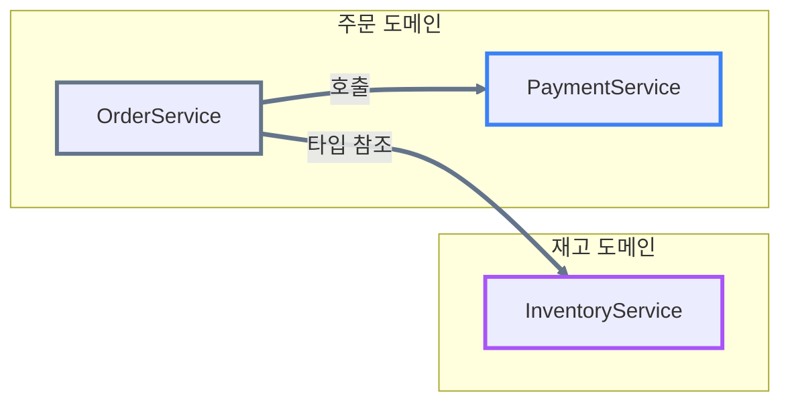
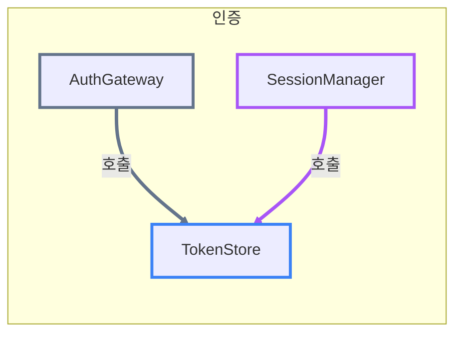

# Complete Examples

Full input→output walkthroughs, end to end. See `templates.md` for the underlying section shapes and `SKILL.md` (Step 2's minimal example) for the rules these follow. Each example below focuses on facets the `SKILL.md` example doesn't show.

## Example 1 — Onboarding, two groups, local-project hyperlinks, hand-off agreed

**User**: "OrderService(src/main/kotlin/order/OrderService.kt)와 PaymentService(src/main/kotlin/order/PaymentService.kt)는 '주문 도메인'에 속해. InventoryService(src/main/kotlin/inventory/InventoryService.kt)는 '재고 도메인'에 속해. OrderService가 PaymentService를 호출해서 결제를 진행하고(호출), InventoryService의 재고 수량 타입을 참조해서 주문 가능 여부를 판단해(타입 참조). OrderService는 주문 생성을 담당하고, PaymentService는 결제 처리를 담당해. 이 저장소 루트 기준 경로야."

**Skill** (purpose not stated and not inferable from context → asks, user picks 1/온보딩) writes `.zenuml/order-inventory.architecture.md`:

````markdown
### Dependency



> 참고: 위 다이어그램 노드에는 `click` 지시어로 해당 소스 파일 경로를 연결해 두었습니다. 다만 VS Code 마크다운 미리보기의 Mermaid 렌더러는 보안상 로컬 파일로의 클릭 이동을 지원하지 않을 수 있습니다. 이 경우 아래 Responsibility 섹션의 마크다운 링크를 이용합니다.

### Responsibility

#### 그룹의 책임

- <strong>[주문 도메인](../src/main/kotlin/order/)</strong>
  - <strong>책임 (추상)</strong>: 주문 생성과 결제 진행을 담당한다.
  - <strong>역할 (구체)</strong>: `OrderService`와 `PaymentService`를 통해 주문 생성과 결제 처리를 수행한다.
- <strong>[재고 도메인](../src/main/kotlin/inventory/)</strong>
  - <strong>책임 (추상)</strong>: 재고 수량 정보를 제공한다.
  - <strong>역할 (구체)</strong>: `InventoryService`가 재고 수량 타입을 노출해 주문 가능 여부 판단에 쓰인다.

#### 요소의 책임

- <strong>[OrderService](../src/main/kotlin/order/OrderService.kt)</strong>
  - <strong>책임 (추상)</strong>: 주문 생성을 담당한다.
  - <strong>역할 (구체)</strong>: 주문을 생성하는 처리를 수행한다.
- <strong>[PaymentService](../src/main/kotlin/order/PaymentService.kt)</strong>
  - <strong>책임 (추상)</strong>: 결제 처리를 담당한다.
  - <strong>역할 (구체)</strong>: 결제를 진행하는 처리를 수행한다.
- <strong>[InventoryService](../src/main/kotlin/inventory/InventoryService.kt)</strong>
  - <strong>책임 (추상)</strong>: 재고 수량 정보를 제공한다.
  - <strong>역할 (구체)</strong>: 설명에 구체적인 동작이 명시되지 않음 — 재고 수량 타입만 언급됨.

### Collaboration

#### 그룹 간 비교

- <strong>[주문 도메인](../src/main/kotlin/order/)</strong>는 <strong>[재고 도메인](../src/main/kotlin/inventory/)</strong>에 의존한다.
  - <strong>책임의 경계</strong>
    - 주문 도메인은 주문 생성과 결제를 책임진다.
    - 재고 도메인은 재고 수량 정보를 책임진다.
    - 경계는 `OrderService`가 주문 가능 여부를 판단하려고 `InventoryService`의 재고 수량 타입을 참조하는 지점이다.
  - <strong>분리 이유 & 합리성 평가</strong>
    - 주문 처리와 재고 관리는 서로 다른 이유로 바뀌므로 하나로 합치지 않았다.
    - 재고 도메인이 여러 주문 관련 도메인에서 재사용될 수 있다면 이 분리는 합리적이다.
  - <strong>내가 할 수 있는 질문</strong>
    - 주문 도메인이 재고 도메인의 내부 저장 방식까지 알고 있지는 않은가?
    - 재고 확인 실패 시 처리 책임은 어느 쪽에 있는가?

#### 요소 간 비교

- <strong>[OrderService](../src/main/kotlin/order/OrderService.kt)</strong>는 <strong>[PaymentService](../src/main/kotlin/order/PaymentService.kt)</strong>에 의존한다.
  - <strong>책임의 경계</strong>
    - `OrderService`는 주문 생성을 책임진다.
    - `PaymentService`는 결제 처리를 책임진다.
    - 경계는 `OrderService`가 결제가 필요한 시점에 `PaymentService`를 호출하는 지점이다.
  - <strong>분리 이유 & 합리성 평가</strong>
    - 주문 생성과 결제 처리를 하나로 합치지 않아 각자의 변경 이유를 분리한다.
    - 결제 수단이 늘어나도 주문 생성 로직은 영향받지 않으므로 합리적이다.
  - <strong>내가 할 수 있는 질문</strong>
    - `OrderService`가 결제 수단별 분기까지 알고 있지는 않은가?
    - `PaymentService`가 주문 상태를 직접 변경하지는 않는가?
- <strong>[OrderService](../src/main/kotlin/order/OrderService.kt)</strong>는 <strong>[InventoryService](../src/main/kotlin/inventory/InventoryService.kt)</strong>에 의존한다.
  - <strong>책임의 경계</strong>
    - `OrderService`는 주문 가능 여부를 판단한다.
    - `InventoryService`는 재고 수량 정보를 제공한다.
    - 경계는 `OrderService`가 `InventoryService`의 재고 수량 타입을 참조해 판단에 쓰는 지점이다.
  - <strong>분리 이유 & 합리성 평가</strong>
    - 재고 조회를 주문 로직과 분리해 재고 도메인이 다른 소비자에게도 재사용될 수 있게 한다.
    - 재고 수량이라는 타입만 참조하고 내부 구현을 알지 않는다면 합리적이다.
  - <strong>내가 할 수 있는 질문</strong>
    - `OrderService`가 `InventoryService`의 내부 저장 구조까지 알고 있지는 않은가?
    - 이 참조가 타입 하나로 충분한가, 더 넓은 API가 필요한가?
````

**Skill** responds with the file link and the hand-off question. **User**: "응, 만들어줘." **Skill** runs `generating-zenuml-diagrams` with an enriched description built from the above and appends its `.zenuml/order-inventory.md` link.

## Example 2 — Troubleshooting, multi-target consolidation, web-repo hyperlinks, hand-off declined

**User** (troubleshooting stated up front): "NotificationDispatcher가 문제인 것 같아 봐야 해. '알림 모듈'의 NotificationDispatcher가 '채널 모듈'에 속한 EmailSender, SmsSender, PushSender를 전부 호출해서(호출) 발송을 위임하고, '템플릿 모듈'의 TemplateRenderer가 만든 렌더링 결과 타입도 참조해(타입 참조). EmailSender는 sendEmail()을, SmsSender는 sendSms()를, PushSender는 sendPush()를 각각 호출해서 발송하는데, 셋 다 발송 채널을 구현하는 동일한 역할이야. 이 저장소는 https://github.com/example/notify-service 에 있고, NotificationDispatcher는 src/notify/NotificationDispatcher.kt, EmailSender/SmsSender/PushSender는 각각 src/channel/EmailSender.kt·SmsSender.kt·PushSender.kt, TemplateRenderer는 src/template/TemplateRenderer.kt에 있어."

**Skill** (purpose already stated as troubleshooting — no question needed) writes `.zenuml/notify-dispatch.architecture.md`. Dependency has 3 groups (알림 모듈, 채널 모듈, 템플릿 모듈) with `click` directives pointing at full GitHub URLs (e.g. `https://github.com/example/notify-service/blob/main/src/channel/EmailSender.kt`) instead of relative paths, since the evidence here is a web repository, not the local project.

Responsibility lists 알림 모듈, 채널 모듈, 템플릿 모듈 (그룹) and NotificationDispatcher, TemplateRenderer (요소) individually — same shape as Example 1, omitted here for brevity. EmailSender/SmsSender/PushSender, however, qualify for parallel-sibling consolidation (3 elements, same group, same parallel role — each is its own channel-sender implementation, no member with a genuinely different kind of role) and get one combined entry instead of three:

````markdown
- <strong>[EmailSender](https://github.com/example/notify-service/blob/main/src/channel/EmailSender.kt)</strong>, <strong>[SmsSender](https://github.com/example/notify-service/blob/main/src/channel/SmsSender.kt)</strong>, <strong>[PushSender](https://github.com/example/notify-service/blob/main/src/channel/PushSender.kt)</strong>
  - <strong>책임 (추상)</strong>: 각자의 발송 채널을 구현해 실제 메시지를 내보낸다.
  - <strong>역할 (구체)</strong>: `EmailSender`는 `sendEmail()`을, `SmsSender`는 `sendSms()`를, `PushSender`는 `sendPush()`를 호출해 발송한다.
````

Each sender's own function name (`sendEmail()` vs `sendSms()` vs `sendPush()`) is a different name filling the same role, not a difference in kind — that's exactly why this still consolidates instead of blocking it. If PushSender additionally managed its own retry policy that EmailSender/SmsSender don't have, that would be a real difference in kind, and PushSender would be excluded from this combined entry and given its own individual one instead.

Collaboration:

````markdown
### Collaboration

#### 그룹 간 비교

- <strong>[알림 모듈](...)</strong>는 <strong>[채널 모듈](...)</strong>에 의존한다.
  - <strong>책임의 경계</strong>
    - 알림 모듈은 어떤 알림을 언제 보낼지 결정한다.
    - 채널 모듈은 실제 발송 수단별 구현을 제공한다.
    - 경계는 `NotificationDispatcher`가 각 채널 발신자를 호출하는 지점이다.
  - <strong>분리 이유 & 합리성 평가</strong>
    - 발송 결정 로직과 채널별 발송 구현을 분리해 새 채널 추가가 결정 로직에 영향을 주지 않게 한다.
    - 채널이 3개 이상으로 늘어난 현재 상태에서 이 분리는 특히 합리적이다.
  - <strong>내가 할 수 있는 질문</strong>
    - 알림 모듈이 채널별 API 세부사항까지 알고 있지는 않은가?
    - 채널 모듈이 알림 정책을 스스로 판단하고 있지는 않은가?
- <strong>[알림 모듈](...)</strong>는 <strong>[템플릿 모듈](...)</strong>에 의존한다.
  - <strong>책임의 경계</strong>
    - 알림 모듈은 언제 무엇을 보낼지 결정한다.
    - 템플릿 모듈은 보낼 내용을 렌더링한다.
    - 경계는 `NotificationDispatcher`가 `TemplateRenderer`의 렌더링 결과 타입을 참조하는 지점이다.
  - <strong>분리 이유 & 합리성 평가</strong>
    - 렌더링 로직을 알림 발송 결정에서 분리해 템플릿 변경이 발송 로직에 영향을 주지 않게 한다.
    - 템플릿 형식이 채널마다 다를 수 있다면 이 분리는 합리적이다.
  - <strong>내가 할 수 있는 질문</strong>
    - 알림 모듈이 템플릿 렌더링 세부 로직까지 알고 있지는 않은가?
    - 렌더링 실패 시 처리 책임은 어느 쪽에 있는가?

#### 요소 간 비교

- <strong>[NotificationDispatcher](...)</strong>는 <strong>채널 발신 요소들</strong>에 의존한다.
  - <strong>책임의 경계</strong>
    - `NotificationDispatcher`는 어떤 채널로 보낼지 결정하고 호출한다.
    - 채널 발신 요소들(`EmailSender`, `SmsSender`, `PushSender`)은 각자의 실제 발송 수단을 구현한다.
    - 경계는 `NotificationDispatcher`가 각 발신자를 호출하는 지점이다.
  - <strong>분리 이유 & 합리성 평가</strong>
    - 채널별 발송 구현을 각 발신자에 분산해 새 채널 추가 시 `NotificationDispatcher`를 건드리지 않게 한다.
    - 세 채널 모두 동일한 방식(호출)으로 위임되므로 이 분리는 일관적이다.
  - <strong>내가 할 수 있는 질문</strong>
    - 각 발신자의 호출 형태가 일관된가?
    - `NotificationDispatcher`가 특정 채널의 실패를 다르게 처리하지는 않는가?
- <strong>[NotificationDispatcher](...)</strong>는 <strong>[TemplateRenderer](...)</strong>에 의존한다.
  - <strong>책임의 경계</strong>
    - `NotificationDispatcher`는 렌더링 결과를 소비한다.
    - `TemplateRenderer`는 렌더링 결과를 만든다.
    - 경계는 렌더링 결과 타입이 전달되는 지점이다.
  - <strong>분리 이유 & 합리성 평가</strong>
    - 렌더링을 발송 결정과 분리해 템플릿 로직을 독립적으로 테스트할 수 있게 한다.
    - 타입만 참조한다면 이 분리는 합리적이다.
  - <strong>내가 할 수 있는 질문</strong>
    - `NotificationDispatcher`가 렌더링 결과의 내부 구조에 과도하게 의존하고 있지는 않은가?
````

EmailSender, SmsSender, PushSender all share the same group (채널 모듈) and the same relationship nature (호출) from NotificationDispatcher, and all three play the same parallel structural role (each is its own channel-sender implementation) — 3 targets meets the consolidation threshold, so they're collapsed into "채널 발신 요소들" instead of three separate entries, the same way their Responsibility entries were combined above. Each sender having its own distinct function name and its own edge in the diagram doesn't block this — that's just a different implementation filling the same role, not a difference in kind (see the Responsibility consolidation above for the retry-policy counterexample that *would* have excluded PushSender). TemplateRenderer is a single target in a different group with a different nature (타입 참조), so it stays its own entry.

**Skill** responds with the file link and the hand-off question. **User**: "아니, 지금은 구조만 보면 돼." **Skill** ends the response there — no `generating-zenuml-diagrams` run, no repeated offer.

## Example 3 — No hyperlink evidence, single group, unspecified responsibility

**User**: "AuthGateway, TokenStore, SessionManager가 모두 '인증' 이라는 하나의 묶음에 속해. AuthGateway가 TokenStore를 호출해서 토큰을 저장하고, SessionManager도 TokenStore를 호출해서 세션 토큰을 조회해. 어느 파일에 있는지는 몰라."

**Skill** writes `.zenuml/auth-token.architecture.md` — no `click` directives anywhere in Dependency, and no Markdown links in Responsibility/Collaboration, since the description gives no file path or repository URL for anything:

````markdown
### Dependency



### Responsibility

#### 그룹의 책임

- <strong>인증</strong>
  - <strong>책임 (추상)</strong>: 설명에 명시되지 않음 — "인증"이라는 이름 외에 그룹 자체의 역할에 대한 설명은 없음.
  - <strong>역할 (구체)</strong>: 설명에 명시되지 않음.

#### 요소의 책임

- <strong>AuthGateway</strong>
  - <strong>책임 (추상)</strong>: 설명에 명시되지 않음.
  - <strong>역할 (구체)</strong>: `TokenStore`를 호출해 토큰을 저장한다.
- <strong>TokenStore</strong>
  - <strong>책임 (추상)</strong>: 토큰을 저장하고 조회 가능하게 한다.
  - <strong>역할 (구체)</strong>: `AuthGateway`와 `SessionManager`의 호출을 받아 토큰을 저장/제공한다.
- <strong>SessionManager</strong>
  - <strong>책임 (추상)</strong>: 설명에 명시되지 않음.
  - <strong>역할 (구체)</strong>: `TokenStore`를 호출해 세션 토큰을 조회한다.

### Collaboration

#### 요소 간 비교

- <strong>AuthGateway</strong>는 <strong>TokenStore</strong>에 의존한다.
  - <strong>책임의 경계</strong>
    - `AuthGateway`의 구체적 책임은 설명에 명시되지 않았다.
    - `TokenStore`는 토큰을 저장/제공한다.
    - 경계는 `AuthGateway`가 토큰 저장을 위해 `TokenStore`를 호출하는 지점이다.
  - <strong>분리 이유 & 합리성 평가</strong>
    - 토큰 저장을 별도 요소로 분리한 이유는 설명에 명시되지 않았다 — 추측하지 않는다.
  - <strong>내가 할 수 있는 질문</strong>
    - `AuthGateway`의 나머지 책임은 무엇인가?
    - `TokenStore`가 저장소 구현(메모리/DB 등)까지 노출하고 있지는 않은가?
- <strong>SessionManager</strong>는 <strong>TokenStore</strong>에 의존한다.
  - <strong>책임의 경계</strong>
    - `SessionManager`의 구체적 책임은 설명에 명시되지 않았다.
    - `TokenStore`는 토큰을 저장/제공한다.
    - 경계는 `SessionManager`가 세션 토큰 조회를 위해 `TokenStore`를 호출하는 지점이다.
  - <strong>분리 이유 & 합리성 평가</strong>
    - 세션 조회를 별도 요소로 분리한 이유는 설명에 명시되지 않았다 — 추측하지 않는다.
  - <strong>내가 할 수 있는 질문</strong>
    - `SessionManager`의 나머지 책임은 무엇인가?
    - `AuthGateway`와 `SessionManager`가 `TokenStore`를 동시에 호출할 때 경합 문제는 없는가?
````

AuthGateway and SessionManager both call TokenStore but never call each other, so no entry exists for that pair. No group-level Collaboration subsection appears since there's only one group.
