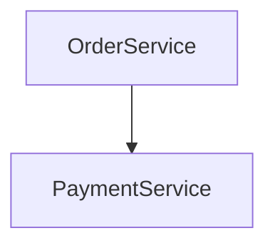
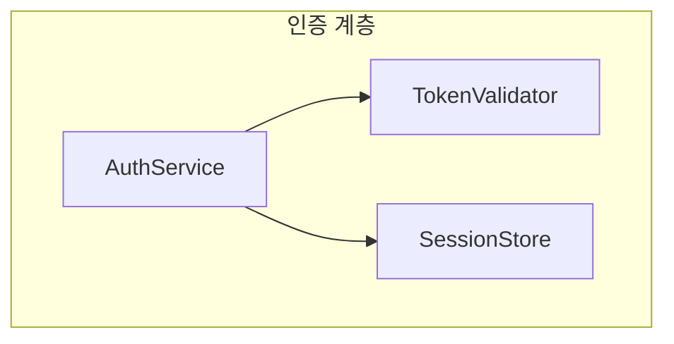
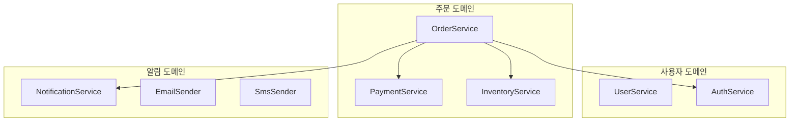

# Complete Examples

Full input→output walkthroughs, end to end. See `templates.md` for the underlying section shapes and `SKILL.md` for the rules these follow.

## Example 1 — Onboarding, no groups, hand-off agreed

**User**: "OrderService는 주문을 생성하고, PaymentService는 결제를 담당하며, OrderService가 PaymentService를 호출한다. 이 시스템의 구조를 보여줘."

**Skill** (purpose not stated → asks):

```text
이 구조 뷰를 어떤 목적으로 보시나요?
1. 온보딩 — 전체 구조를 이해하고 싶다
2. 특정 문제 진단 — 특정 컴포넌트/관계에 집중하고 싶다
3. 기타 — 직접 설명
```

**User**: "1"

**Skill** writes `.zenuml/order-payment.architecture.md` containing:

````markdown
### Components & Dependencies



### Responsibility

- **OrderService**는 **PaymentService**에 의존한다: OrderService는 주문을 생성한다. PaymentService는 결제를 담당한다.
````

**Skill** responds:

```text
📄 [order-payment 구조 뷰](.zenuml/order-payment.architecture.md)

이 구조를 바탕으로 시퀀스 다이어그램도 만들까요?
```

**User**: "응, 만들어줘"

**Skill** runs `generating-zenuml-diagrams` with "OrderService가 주문을 생성하고 PaymentService를 호출해 결제를 처리한다. OrderService는 주문 생성을, PaymentService는 결제 처리를 담당한다." and appends its result:

```text
📄 [order-payment 시퀀스 다이어그램](.zenuml/order-payment.md)
```

No components beyond the two named ones, no invented exception handling or return values in either output.

## Example 2 — Troubleshooting, one group, hand-off declined

**User**: "특정 문제를 진단하려고 해. AuthService, TokenValidator, SessionStore가 모두 '인증 계층'에 속해. AuthService가 TokenValidator와 SessionStore를 둘 다 호출해."

**Skill** (purpose already stated as troubleshooting — no question needed) writes `.zenuml/auth-flow.architecture.md` (3 components in one group, but only 2 dependency edges → 2 Responsibility entries; TokenValidator and SessionStore never call each other, so that pair gets none):

````markdown
### Components & Dependencies



### Responsibility

#### 인증 계층

- **AuthService**는 **TokenValidator**에 의존한다: 책임이 설명에 명시되지 않음. 책임이 설명에 명시되지 않음.
- **AuthService**는 **SessionStore**에 의존한다: 책임이 설명에 명시되지 않음. 책임이 설명에 명시되지 않음.
````

(The description never stated what any of the three actually does, only that they're grouped and who calls whom — so every responsibility and difference is honestly marked unspecified rather than guessed from the component names. TokenValidator and SessionStore never call each other, so — unlike an earlier version of this skill — no entry is generated for that pair at all, even though all three share a group.)

**Skill** responds with the file link and the hand-off question. **User**: "아니, 지금은 구조만 보면 돼." **Skill** ends the response there — no `generating-zenuml-diagrams` run, no repeated offer.

## Example 3 — Three groups, group-to-group comparison

**User** (onboarding): "'사용자 도메인'에는 UserService, AuthService가 있고, '주문 도메인'에는 OrderService, PaymentService, InventoryService가 있고, '알림 도메인'에는 NotificationService, EmailSender, SmsSender가 있어. OrderService가 PaymentService, InventoryService, AuthService, NotificationService를 호출해."

**Skill** writes `.zenuml/three-domains.architecture.md` (3 groups, but group-to-group entries only where a cross-group dependency edge actually exists — 사용자 도메인↔주문 도메인 and 주문 도메인↔알림 도메인 are connected, 사용자 도메인↔알림 도메인 is not, so 2 group-level entries instead of 3×2/2=3 — plus within-group entries only where a dependency edge actually exists — 0+2+0=2 total):

````markdown
### Components & Dependencies



### Responsibility

#### 그룹 간 비교

- **주문 도메인**는 **사용자 도메인**에 의존한다: 주문 도메인. 사용자 도메인.
- **주문 도메인**는 **알림 도메인**에 의존한다: 주문 도메인. 알림 도메인.

#### 주문 도메인

- **OrderService**는 **PaymentService**에 의존한다: 책임이 설명에 명시되지 않음. 책임이 설명에 명시되지 않음.
- **OrderService**는 **InventoryService**에 의존한다: 책임이 설명에 명시되지 않음. 책임이 설명에 명시되지 않음.
````

사용자 도메인과 알림 도메인 사이에는 서로 연결된 컴포넌트가 하나도 없으므로(둘 다 주문 도메인의 OrderService하고만 연결됨) 그 두 그룹 간 비교 항목 자체가 생성되지 않는다. 마찬가지로 사용자 도메인(UserService, AuthService)과 알림 도메인(NotificationService, EmailSender, SmsSender)은 그룹 내부에서 서로 호출하는 관계가 설명에 전혀 없어 컴포넌트 레벨 항목이 하나도 생성되지 않으므로 `####` 하위 제목 자체가 나타나지 않는다 — PaymentService와 InventoryService도 같은 이유로 항목이 없다(둘 다 OrderService의 호출 대상일 뿐 서로는 호출하지 않는다).

OrderService calls AuthService and NotificationService directly (cross-group arrows in Components & Dependencies), but there is no component-level entry for either pair — cross-group contrast happens only at the group level ("주문 도메인은 사용자 도메인에 의존한다", etc.), never between individual components in different groups.

## Example 4 — Large group, scale warning

**User** (onboarding): describes a `PaymentDomain` group containing 8 named components, each with a one-line responsibility, and several call relationships among them.

**Skill** writes the Components & Dependencies graph (one `subgraph PaymentDomain` with all 8 components and the described arrows), then before the Responsibility list says:

```text
PaymentDomain 그룹에 컴포넌트가 8개 있어 Responsibility 섹션에 28개(8×7/2) 항목이 생성됩니다 — 결과가 길 수 있습니다.
```

...and still generates all 28 entries in full — it does not truncate the list or invent a way to shrink the group.
