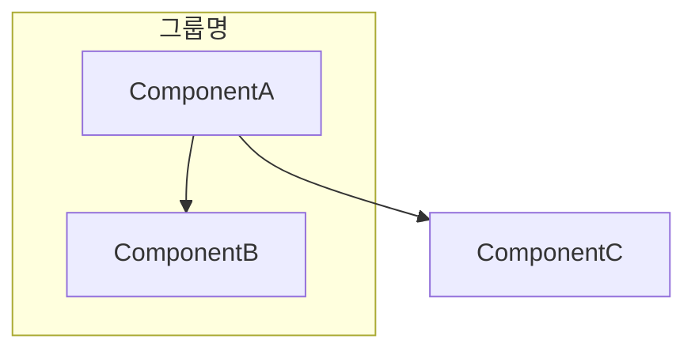
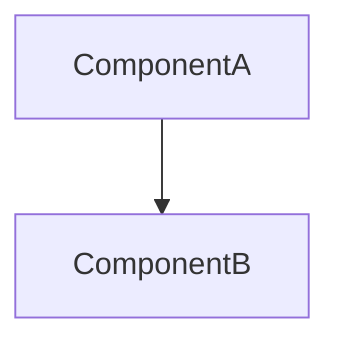

# Section Templates

Reusable Mermaid and prose templates for the two sections this skill produces. Read this after `SKILL.md`'s generation rules — it only shows *shape*, not what content is allowed (that's governed by the anti-fluff rules in `SKILL.md`).

## Table of Contents

- [Components & Dependencies template](#components--dependencies-template)
- [Responsibility template](#responsibility-template)
  - [Group-to-group comparisons](#group-to-group-comparisons)
  - [Within-group comparisons](#within-group-comparisons)

## Components & Dependencies template

Components are Mermaid `graph` nodes; evidence-based groups are `subgraph`; dependencies are arrows. When there is no grouping signal, omit `subgraph` entirely and list all components at the top level.

Both sections in the output file get a `###` heading (never `##` or shallower — see `SKILL.md`, "Output file") so the two sections are easy to tell apart at a glance.

With groups:

````markdown
### Components & Dependencies


````

Without groups (no grouping signal in the description):

````markdown
### Components & Dependencies


````

- Use `-->` for a described call/dependency. Label the arrow only if the description names the interaction (e.g., `ComponentA -->|호출| ComponentB`) — don't invent a label.
- Draw only edges the description directly states or implies between those exact two components. If it only describes a chain (A calls B, B calls C), draw `A --> B` and `B --> C` — never a shortcut `A --> C` that skips the intermediate hop.
- One `subgraph` per evidence-based group. Group names come from the description's own wording (a domain/layer name it used), never invented.

## Responsibility template

Two levels of dependency-gated comparison, in this order: groups against each other first (if there are 2+ groups), then components within each group. Both levels use the same gate: only pair two items (groups, or components within a group) that are actually connected by at least one dependency edge — walk the dependency edges (not all possible pairs) in first-appearance order, skipping any pair already produced. This yields exactly one entry per connected pair, never one for a pair with no dependency between them, at either level.

Every entry's label puts both names in bold and states the real dependency direction — never a neutral "vs". If exactly one direction exists, write "**A**는 **B**에 의존한다"; if the dependency runs both ways, write "**A**와 **B**는 서로 의존한다" instead of picking one side arbitrarily. Separate clauses with periods, never semicolons, and stop once both sides' responsibilities/labels are stated — no separate "차이: ..." summary sentence; reading the two side by side already shows the contrast.

```markdown
### Responsibility

#### 그룹 간 비교 (그룹이 2개 이상이고, 그 중 실제로 의존관계로 연결된 쌍이 하나 이상 있을 때만 — 그런 쌍이 없으면 이 하위 제목 자체를 생략)

- **그룹A**는 **그룹B**에 의존한다: 그룹A는 <그룹에 부여된 이름/레이블 그대로>. 그룹B는 <그룹에 부여된 이름/레이블 그대로>.
- **그룹A**와 **그룹C**는 서로 의존한다: ... (그룹A와 그룹C가 양방향으로 연결되어 있을 때)

#### 그룹A (그룹이 없으면 이 하위 제목은 생략하고 아래 목록만 최상위에 둠; 그룹 내에 의존관계로 연결된 쌍이 하나도 없으면 이 하위 제목 자체를 생략)

- **ComponentA**는 **ComponentB**에 의존한다: ComponentA는 <설명에서 확인된 책임>. ComponentB는 <설명에서 확인된 책임>.
- **ComponentA**는 **ComponentC**에 의존한다: ... (ComponentA와 ComponentC가 실제로 서로 호출할 때만)

#### 그룹B

...
```

위 예시는 그룹A↔그룹B, ComponentA↔ComponentB, ComponentA↔ComponentC가 실제로 의존관계로 연결되어 있다고 가정한 모양이다. 연결되지 않은 쌍(예: 그룹B와 그룹C, 또는 ComponentB와 ComponentC)은 그룹에 속한 것만으로는 비교 대상이 되지 않으므로 항목을 만들지 않는다.

### Group-to-group comparisons

- Only exists when there are 2 or more groups **and** at least one pair of them has a cross-group dependency edge. Zero or one group, or no cross-group edges at all → skip this subsection entirely.
- Only pair two groups that have at least one dependency edge between their members — a group pair with no such edge gets no entry, exactly like the within-group level below.
- The "responsibility" of a group always includes the name/label the description actually gave it, plus anything else the description actually states about that group beyond the bare label — never an inferred/guessed summary of what its member components do that the description didn't itself say. If a group has no name (shouldn't happen — a group only exists because a naming/domain signal was found), this level doesn't apply.
- Entry count = number of group pairs with at least one cross-group edge; the ceiling is m×(m-1)/2 only if every possible group pair happens to be connected.

### Within-group comparisons

- One entry per unordered pair within a group (or within the whole component set, if there is no group at all) that is **directly connected by a dependency** in Components & Dependencies — call direction doesn't matter, but the call itself must exist.
- Never add an entry for a pair that doesn't call each other, even though they share a group — sharing a group is not by itself grounds for a comparison entry at this level (that's what the group level above is for).
- If a component's own responsibility isn't stated in the description, write `책임이 설명에 명시되지 않음` for that component in every entry it appears in — never guess a plausible-sounding responsibility to fill the gap.
- Never add an entry between components that are in different groups — cross-group contrast happens only at the group level above, never at the component level.
- The entry count for a group equals its number of internal dependency edges, never more — n×(n-1)/2 is only the ceiling for a group of size n where every possible pair happens to call each other. A group with zero internal dependency edges gets zero entries and no sub-heading at all.
