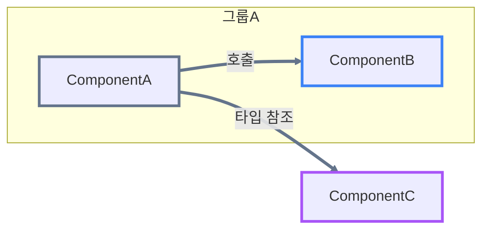

# Section Templates

Reusable Mermaid and prose templates for the three sections this skill produces. Read this after `SKILL.md`'s generation rules — it only shows *shape*, not what content is allowed (that's governed by the anti-fluff rules in `SKILL.md`).

## Table of Contents

- [Dependency template](#dependency-template)
  - [Color palette](#color-palette)
  - [Hyperlink syntax](#hyperlink-syntax)
- [Responsibility template](#responsibility-template)
  - [Parallel-sibling consolidation](#parallel-sibling-consolidation)
- [Collaboration template](#collaboration-template)
  - [Group-to-group comparisons](#group-to-group-comparisons)
  - [Element-to-element comparisons](#element-to-element-comparisons)
  - [Multi-target consolidation](#multi-target-consolidation)

All three sections in the output file get a `###` heading (never `##` or shallower — see `SKILL.md`, "Output file") so they're easy to tell apart at a glance.

## Dependency template

Every diagram opens with this fixed styling block, then `flowchart LR`. Groups are `subgraph` with `direction TB`; components with no grouping signal sit at the top level instead.

````markdown
### Dependency



> 참고: 위 다이어그램 노드에는 `click` 지시어로 해당 소스 파일 경로를 연결해 두었습니다. 다만 VS Code 마크다운 미리보기의 Mermaid 렌더러는 보안상 로컬 파일로의 클릭 이동을 지원하지 않을 수 있습니다. 이 경우 아래 Responsibility 섹션의 마크다운 링크를 이용합니다.
````

Rules:

- `subgraph` only for evidence-based groups (a name/layer/domain signal in the description); components with no such signal sit at the top level, no `subgraph` at all.
- Every edge gets a `-->|관계 성격|` label. Use the description's own wording for the nature (호출, 타입 참조, 선언 참조, ... — open vocabulary, not a fixed enum). No stated nature → default label "호출".
- Draw only edges the description directly states or implies between those exact two components. A described chain (A calls B, B calls C) becomes `A --> B` and `B --> C` — never a collapsed `A --> C` shortcut.
- Every node gets a `classDef` + `class` pair. Name the class after the node's role, not a generic counter (`navHostNode`, not `class3`).
- Every edge's `linkStyle` (indexed in the order the edges appear in the diagram, starting at 0) matches its **source** node's color.
- `click` is optional per node — attach it only when "Hyperlink syntax" below resolves a real target for that node; omit it otherwise. Include the "참고: ..." note beneath the diagram only when at least one `click` target is a local path (see `SKILL.md`, Step 2).

### Color palette

Assign colors from this fixed, ordered list (Tailwind CSS 500-shade hex values) to nodes in the order they're first introduced (a node that originates an edge, or otherwise needs individual distinction, claims the next unused color; interchangeable siblings that need no individual distinction share one class instead of each claiming a new color). Cycle back to the start of the list in the rare case a diagram needs more than 16 distinct colors.

| # | Name | Hex |
|---|------|-----|
| 1 | slate | `#64748B` |
| 2 | blue | `#3B82F6` |
| 3 | purple | `#A855F7` |
| 4 | yellow | `#EAB308` |
| 5 | cyan | `#06B6D4` |
| 6 | orange | `#F97316` |
| 7 | pink | `#EC4899` |
| 8 | green | `#22C55E` |
| 9 | red | `#EF4444` |
| 10 | indigo | `#6366F1` |
| 11 | teal | `#14B8A6` |
| 12 | violet | `#8B5CF6` |
| 13 | amber | `#F59E0B` |
| 14 | lime | `#84CC16` |
| 15 | rose | `#F43F5E` |
| 16 | fuchsia | `#D946EF` |

Node border width is always `3px`; edge (`linkStyle`) width is always `3.5px`.

### Hyperlink syntax

`click <NodeName> "<target>" "<label>"` — `target` is a relative path (from `.zenuml/`, e.g. `../app/src/.../Foo.kt`) or a full URL; `label` is a short tooltip, usually the file's own name. See `SKILL.md`, "Hyperlink resolution" for how `target` is determined (local root project / web repository / no link — resolve once and reuse the identical target for the Markdown link on the same name in Responsibility/Collaboration).

## Responsibility template

No pairwise comparisons — one entry per group, one entry per element, each with two sub-bullets. Group subsection first (skipped entirely if there are no groups), then element subsection.

```markdown
### Responsibility

#### 그룹의 책임

- <strong>[그룹A](../path/to/group-a/)</strong>
  - <strong>책임 (추상)</strong>: <한 문장 요약>
  - <strong>역할 (구체)</strong>: <설명이 실제로 언급한 이름·동작을 인용한 구체적 서술, 코드 수준 식별자는 `백틱`으로>

#### 요소의 책임

- <strong>[ComponentA](../path/to/ComponentA.kt)</strong>
  - <strong>책임 (추상)</strong>: <한 문장 요약>
  - <strong>역할 (구체)</strong>: <구체적 서술, 또는 "설명에 명시되지 않음">
```

- Bold name uses `<strong>...</strong>` (never markdown `**...**`) and is hyperlinked per "Hyperlink syntax" above when a target resolves; plain `<strong>` text otherwise (no fabricated link).
- `책임 (추상)`/`역할 (구체)` labels themselves are also `<strong>`, matching the name.
- Either sub-bullet can independently be `설명에 명시되지 않음` when the description doesn't support it — never invent to fill the gap.
- Every code-level identifier (class/function/property/enum-case name) cited in 역할 (구체) is wrapped in backtick code spans — e.g. `` `navigateToTopLevelDestination()` ``, not bare prose.

### Parallel-sibling consolidation

3 or more elements that share a group and a parallel structural role (same kind of slot in the pattern, no member with a genuinely different kind of role) get one combined entry instead of one each:

```markdown
- <strong>[EmailSender](../path/to/EmailSender.kt)</strong>, <strong>[SmsSender](../path/to/SmsSender.kt)</strong>, <strong>[PushSender](../path/to/PushSender.kt)</strong>
  - <strong>책임 (추상)</strong>: <셋이 공유하는 병렬 역할을 설명하는 한 문장>
  - <strong>역할 (구체)</strong>: <각 요소가 실제로 언급하는 이름·동작을 요소별로 빠짐없이 인용, 예: `EmailSender`는 `sendEmail()`을, `SmsSender`는 `sendSms()`를, `PushSender`는 `sendPush()`를 호출한다>
```

Every member's name is individually hyperlinked in the heading (joined with commas), never a collective phrase in place of the names. 역할 (구체) must still name-check every member — consolidating the entry shrinks the entry count, not the evidence. A member with a real difference in kind (an extra responsibility/relationship the others lack, not just a different name) is excluded and gets its own individual entry instead. This reuses the exact same 3+ threshold and judgment as Collaboration's "Multi-target consolidation" below — see that section for the full rule.

## Collaboration template

Two levels, group-to-group first (only if 2+ groups), then element-to-element. Both levels are gated the same way: an entry exists only for a pair (or consolidated source-and-target-set) with a real dependency edge between them.

```markdown
### Collaboration

#### 그룹 간 비교

- <strong>[그룹A](../path/to/group-a/)</strong>는 <strong>[그룹B](../path/to/group-b/)</strong>에 의존한다.
  - <strong>책임의 경계</strong>
    - <그룹A가 맡은 것>
    - <그룹B가 맡은 것>
    - <경계가 넘어가는 지점>
  - <strong>분리 이유 & 합리성 평가</strong>
    - <왜 하나로 합치지 않았는지>
    - <지금도 타당한지>
  - <strong>내가 할 수 있는 질문</strong>
    - <검토 시 다시 물어볼 질문 1>
    - <검토 시 다시 물어볼 질문 2>

#### 요소 간 비교

- <strong>[ComponentA](../path/to/ComponentA.kt)</strong>는 <strong>[ComponentB](../path/to/ComponentB.kt)</strong>에 의존한다.
  - <strong>책임의 경계</strong>
    - ...
  - <strong>분리 이유 & 합리성 평가</strong>
    - ...
  - <strong>내가 할 수 있는 질문</strong>
    - ...

- <strong>[ComponentD](../path/to/ComponentD.kt)</strong>는 <strong>feature 내비게이션 요소들</strong>에 의존한다. (다수 대상을 하나의 서술적 표현으로 묶은 경우 — 아래 "Multi-target consolidation" 참고)
  - <strong>책임의 경계</strong>
    - ...
  - <strong>분리 이유 & 합리성 평가</strong>
    - ...
  - <strong>내가 할 수 있는 질문</strong>
    - ...
```

Direction: one-way → <strong>A</strong>는 <strong>B</strong>에 의존한다; bidirectional → <strong>A</strong>와 <strong>B</strong>는 서로 의존한다 — never a neutral "vs", never an arbitrarily-picked direction. Use `<strong>` tags throughout (names, direction sentence, and all three sub-part headings) — never markdown `**...**`.

Each sub-part (책임의 경계/분리 이유 & 합리성 평가/내가 할 수 있는 질문) is a `<strong>` heading bullet followed by its own nested bullet list of 2–4 short points — never a single inline "레이블: 문장." paragraph. Wrap every cited code-level identifier in the nested bullets in backticks; a group/element already named in a `<strong>[이름](경로)</strong>` heading elsewhere is referred to **inside these nested bullets** with plain backticks, not re-bolded or re-linked. That plain-backtick treatment never extends to the entry's opening line — the opening line's names (both group-level and element-level) always keep their own `<strong>[이름](경로)</strong>` bold-and-hyperlink form, same as the Responsibility heading for that same name (see the examples above: `<strong>[ComponentA](../path/to/ComponentA.kt)</strong>는 <strong>[ComponentB](../path/to/ComponentB.kt)</strong>에 의존한다`).

### Group-to-group comparisons

- Only exists when there are 2 or more groups **and** at least one pair has a cross-group dependency edge. Otherwise skip this subsection entirely.
- One entry per group pair with at least one dependency edge crossing between their members — a pair with no such edge gets no entry.
- Ground each group's identity in the name/label the description actually gave it, plus anything else the description states about it beyond the bare label — never a guessed role/purpose.

### Element-to-element comparisons

- One entry per unordered pair of elements **directly connected by a dependency**, in first-appearance order (walk source nodes in the order they first appear, then each source's edges in the order they appear).
- Same-group and cross-group pairs are treated identically here — being in different groups doesn't exclude a pair from this level (that's a change from earlier drafts of this skill: cross-group element pairs get their own entry *and* contribute to the group-level entry above, they aren't mutually exclusive).
- Never add an entry for a pair with no direct dependency, regardless of shared group membership.

### Multi-target consolidation

When one source has **3 or more** targets that share the same group, share the same relationship nature, and play a parallel structural role relative to that source (each fills the same kind of slot in the pattern), replace the individual entries with one entry whose target side names the set collectively (e.g. "feature 내비게이션 요소들") instead of listing each. Don't hyperlink a collective phrase — link only real, single named targets.

Targets with their own edges elsewhere, or their own distinct Responsibility wording (different function names, for instance), still qualify — that's just a different name/implementation filling the same role, not a reason to exclude. Only a target with a real difference in kind (a responsibility or relationship the others don't have) is excluded from the collective phrase and gets its own individual entry.

2 or fewer targets, mixed groups, or mixed relationship natures → list every target by name instead (joined with "와"/"과" for exactly two), no consolidation.
