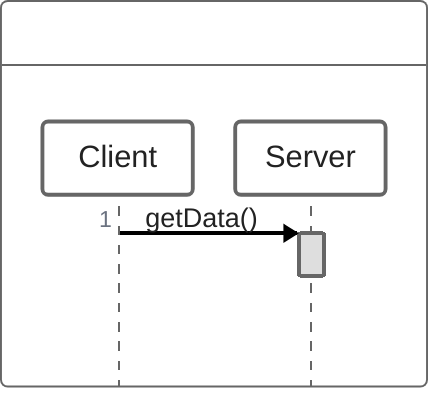
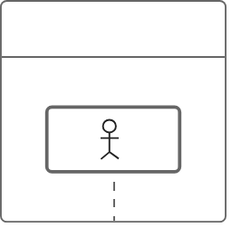

# Generating ZenUML Diagrams

## Syntax reference

Full grammar: [references/syntax.md](references/syntax.md) (participants, messages, control flow, comments, expressions — reorganized from `mermaid-js/zenuml-core`'s `docs/DSL_SYNTAX.md`, MIT licensed). Read it before generating; do not guess syntax.

Target renderer/grammar baseline: `mermaid-js/zenuml-core`. Do not assume compatibility with the standalone `zenuml.com` product or other ZenUML tooling unless the user says so.

## Request classification (do this first)

Before generating anything, checking syntax, or touching any file, classify the request. This determines which of the branches below applies, and getting it wrong risks silently overwriting an unrelated diagram or appending history to the wrong log — so don't skip or defer this.

1. **Regeneration** — this message is a follow-up asking to change a diagram already presented earlier in this conversation (e.g. "use Gateway instead of Server", "add a return value", "that's not quite right, retry"). The target is that diagram's existing `<slug>`.
2. **Initial generation** — a self-contained description of a process that isn't a follow-up to something just shown, and no `.zenuml/<slug>.md` exists yet for the slug derived from it.
3. **New request with a colliding slug** — same as (2), but the slug derived from this description happens to already name an existing, unrelated `.zenuml/<slug>.md`. Treat the two diagrams as unrelated: apply the existing name-collision rule (see "Output file" below — append `-2`, `-3`, ...) rather than the regeneration rule.
4. **Still ambiguous** — if, after weighing the conversation context, it's genuinely unclear whether this is (1) or (2)/(3), don't guess and don't write or overwrite any file. Ask directly, e.g., "Are you asking me to change the diagram I just made, or create a new one?"

Only proceed past this point once the request is classified as (1), (2), or (3).

## Generation rules

- Use only the participants, messages, and control-flow structures that the user's description explicitly states or clearly implies. Never add a participant, call, branch, loop, or exception handler that isn't grounded in the input.
- When a call chain is described ("A calls B, which calls C"), nest the calls with braces per the syntax reference rather than flattening them into a sequence of unrelated messages.
- Prefer the shallowest nesting that still represents the described logic correctly.
- The ZenUML DSL text is the primary output, but don't paste it into the chat response — save it to a file and link to it (see "Output file" below).
- If the description implies a very large number of participants or an unusually complex flow, still generate it faithfully — don't silently drop or simplify described content — but tell the user the result may be hard to read, and suggest splitting it into multiple diagrams if that would help.

### Example: minimal request

Input: "Client calls Server.getData()."

Generated ZenUML (this goes into the output file per "Output file" below, not pasted into the chat response):

```text
Client->Server.getData()
```

Only two participants, one call, no wrapping/outer call invented to hold it. No return value, error handling, or extra participants are added because none were described.

### Example: request with conditional flow

Input: "A user submits a login form. AuthService validates the credentials. If valid, it creates a Session and returns it. If not, the user can retry up to 3 times."

Generated ZenUML (this goes into the output file per "Output file" below, not pasted into the chat response):

```text
User.submitLogin() {
  if (AuthService.validate(credentials)) {
    session = AuthService.createSession()
    return session
  } else {
    // retry up to 3 times, per the description
    loop (attempts < 3) {
      AuthService.validate(credentials)
    }
  }
}
```

Only the branching and looping actually described is represented — no invented logging, no unrelated participants, no exception handling that wasn't mentioned.

## Self-check before presenting a diagram

Before showing a generated diagram to the user, check the draft against this list. Copy it into your working notes and go through it every time:

```text
ZenUML anti-pattern check:
- [ ] AP-1: No participants beyond what the description states or clearly implies
- [ ] AP-2: No messages/method calls beyond what the description states or clearly implies
- [ ] AP-3: No conditional branches or loops beyond what the description states or clearly implies
- [ ] AP-4: No unjustified try/catch blocks or invented return values
- [ ] AP-5: Uses the shallowest nesting that still represents the described logic
```

Workflow: **generate a draft → check it against AP-1 through AP-5 → if anything fails, revise the draft → re-check → only then present the result to the user.** A draft that hasn't passed all five items is not ready to show. If a fix for one item would violate another (rare), prefer accuracy (AP-1–AP-4) over minimal nesting (AP-5).

For a simple, unambiguous request the check is quick — don't narrate it verbatim to the user, just perform it before responding.

## Output file

Don't paste the ZenUML code into the chat response, and don't publish it as a Claude Artifact — Artifacts auto-open/preview in the client the moment they're published, with no parameter to suppress that, which gets intrusive for something generated on every request. Write a file instead: it only opens when the user actually clicks the link.

**Where**: `.zenuml/<slug>.md` in the project root, where `<slug>` is a short kebab-case name derived from what the diagram is about (e.g. `client-server-getdata.md`). Make sure `.zenuml/` is listed in the project's `.gitignore` — add the entry if it's missing (these are generated files, not source).

- If this is **initial generation** or a **new request with a colliding slug** (see "Request classification" above) and a file with that name already exists, append `-2`, `-3`, etc. rather than overwriting it — the two diagrams are unrelated.
- If this is a **regeneration** of the diagram at `<slug>`, overwrite `.zenuml/<slug>.md` completely with the new content — don't append a suffix, and don't preserve the previous content in this file (the previous content lives on in the feedback log; see below).

**File contents** — the ZenUML DSL inside a `mermaid` code fence using the `zenuml` diagram type. This is both the actual output and the rendered preview — no translation needed. VS Code's built-in Markdown preview (Mermaid Markdown Features, part of the "Markdown Preview Mermaid Support" component) renders `zenuml` natively; confirmed by direct testing. (Claude Artifacts do **not** render `zenuml` — it falls back to plain text there — which is a separate reason this skill writes a file instead of publishing an Artifact; see "Output file" intro above.)

````markdown

````

No title heading needed — the filename already identifies the diagram.

After writing the file, the entire chat response is just a relative link to it — no code block:

📄 [Client calls Server.getData()](.zenuml/client-server-getdata.md)

If the current environment has no filesystem access to write to, skip the file and put the ZenUML DSL in a fenced code block in the chat response instead. Skip the feedback log below too in that case — there's no file to log against.

### Diagram feedback log

Alongside `.zenuml/<slug>.md`, every successfully generated or regenerated diagram gets a feedback log at `.zenuml/log/<slug>.md` — same slug, `log/` subdirectory. This is already covered by the `.zenuml/` `.gitignore` entry above, so it needs no gitignore entry of its own.

Any markdown heading added to `.zenuml/<slug>.md` itself (e.g. a supplementary table title) must be `###` or deeper — never `##` or shallower. This is a property of the primary file, not a log-only rule: each round's `**Response**:` field here echoes `.zenuml/<slug>.md`'s content verbatim underneath that round's own `## Round N — <ISO date>` heading, so keeping the primary file's own headings at `###`+ from the start means they always nest correctly once copied in, with no separate transformation needed at log time.

**What goes in the `**Request**:` field**: not just the single message that immediately triggered this round. Gather every turn since the previous round (or, for Round 1, since the conversation about this diagram started) that actually contributed to what got built — including a clarifying question you asked and the user's answer to it, if that's how this round's content was pinned down. Drop anything unrelated to constructing the diagram (small talk, tangents), and lightly edit the rest into one coherent entry rather than pasting a raw transcript. This costs no extra input tokens — those turns are already in context — and keeps the field short, so it doesn't waste output tokens either.

**On initial generation** (or a new request with a colliding slug), create the log fresh:

````markdown
## Round 1 — <ISO date>
**Request**: <the user's request, verbatim or lightly summarized>

**Response**:

````

**On regeneration**, append a new round to the existing `.zenuml/log/<slug>.md` — never rewrite or delete earlier rounds, no matter how many rounds accumulate:

````markdown
## Round N — <ISO date>
**Request**: <this round's request>

**Response**:

````

Don't summarize, analyze, or prune this log's content, ever — it exists purely so a human can read it later and decide what's worth acting on. After presenting the updated diagram, if the user sends another follow-up, go back to "Request classification" above and classify it fresh — don't assume it's automatically another regeneration of the same diagram.

**Citing a feedback log elsewhere**: `.zenuml/log/` is gitignored by default, same as the rest of `.zenuml/`. If some other piece of work (e.g. a future `/speckit-assess-research` run) actually reads and cites a specific `.zenuml/log/<slug>.md` as a source, stage that one file right then with `git add -f .zenuml/log/<slug>.md` — nothing else in `.zenuml/` gets staged automatically, and uncited logs stay untracked. `.zenuml/<slug>.md` itself is never a citation target — it gets overwritten on every regeneration, so it has no history worth citing. This skill doesn't do any citing itself and this convention doesn't reach into other skills' files — it only documents, here, what to do when the citing happens.

## When the description is ambiguous

If the description doesn't make clear **who calls whom** or **under what condition a branch happens**, don't invent an answer — ask a specific, targeted question instead (e.g., "Does the client call the server directly, or through a gateway?"). Do not generate a diagram with guessed structure just to have something to show.

Don't over-ask, though: minor cosmetic details (exact display names, colors, participant ordering) don't need a question — pick a reasonable default and move on. Only stop for ambiguity that would change the actual structure of the diagram.

## Out-of-scope requests

- **Non-sequence diagrams** (class, deployment, component, etc.): ZenUML supports sequence diagrams only. Say so rather than attempting a workaround.
- **Converting an existing Mermaid/PlantUML diagram, or analyzing a codebase to produce a diagram**: out of scope for this skill. Say so; only natural-language process descriptions are supported as input.
- **Rendering / producing an image**: the primary output is ZenUML DSL text, not an image. The output file already renders as a diagram in VS Code's Markdown preview (see "Output file"); for anything beyond that, tell the user to render it with other `mermaid-js/zenuml-core`-compatible tooling.
