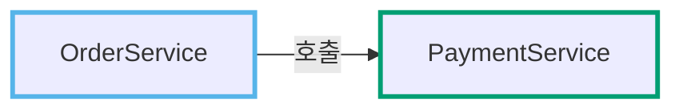

# hover 스타일 접기 테스트

같은 Markdown 파일을 VS Code 미리보기와 GitHub에서 열어 아래 차이를 확인합니다.

- **VS Code**: 아래 다이어그램만 보이고 "적용되지 않은 `<style>` 코드 ([관련 GFM 공식 문서](https://github.github.com/gfm/#disallowed-raw-html-extension-))" 접은 글은 보이지 않아야 합니다. `OrderService`에 마우스를 올리면 화면 아래쪽에 넓은 패널이 떠야 합니다.
- **GitHub**: 다이어그램 아래에 "적용되지 않은 `<style>` 코드 ([관련 GFM 공식 문서](https://github.github.com/gfm/#disallowed-raw-html-extension-))" 접은 글 한 줄이 보여야 합니다. CSS 원문은 접은 글을 펼칠 때만 보여야 합니다.

```mermaid
flowchart LR
  OrderService -->|호출| PaymentService

  classDef orderNode stroke:#56B4E9,stroke-width:3px
  class OrderService orderNode
  classDef paymentNode stroke:#009E73,stroke-width:3px
  class PaymentService paymentNode

  click OrderService "../../README.md" "<b>OrderService</b><br/><b>책임 (추상)</b>: 주문을 생성하고 결제를 요청한다<br/><b>역할 (구체)</b>: <code>create()</code>로 주문을 저장하고 <code>PaymentService.pay()</code>를 호출한다"
  click PaymentService "../../README.md" "<b>PaymentService</b><br/><b>책임 (추상)</b>: 결제를 처리한다<br/><b>역할 (구체)</b>: <code>pay()</code>로 결제 승인을 처리한다"
```

이 문서에 적용되지 못한 &lt;style&gt; 코드 (<a href="https://github.github.com/gfm/#disallowed-raw-html-extension-">관련 GFM 공식 문서</a>)

