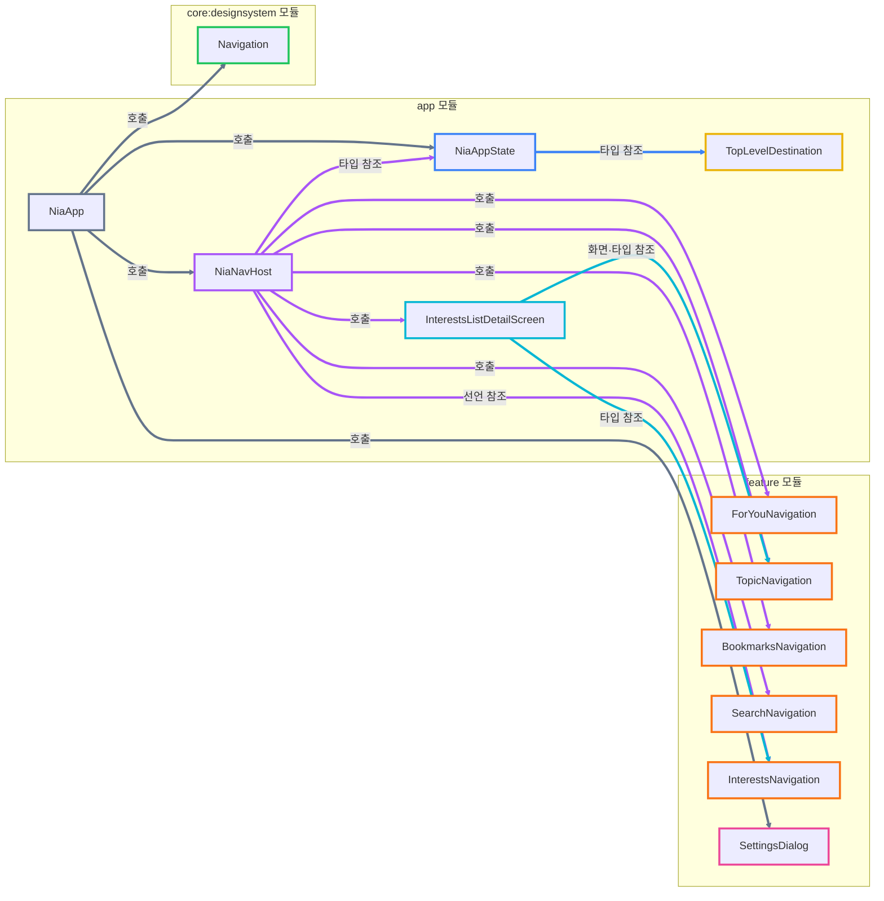

# Reference Example: Hand-Tuned Output Sample

This is the hand-tuned reference output that the Dependency/Responsibility/
Collaboration redesign in [spec.md](spec.md) is based on. It uses the
navigation structure of the Now in Android (NIA) sample app — a
Jetpack Compose codebase — as the worked example the format was tuned
against. It is checked in here so the format it defines can actually be
inspected alongside the spec, instead of being cited by path to an untracked
local file.

(Korean: [spec.md](spec.md)의 Dependency/Responsibility/Collaboration 재구성이
근거로 삼은, 손수 다듬은 참조 산출물이다. Now in Android(NIA) 샘플 앱 — Jetpack
Compose 코드베이스 — 의 내비게이션 구조를 예시로 들어 형식을 다듬었다. 추적되지
않는 로컬 파일 경로로만 인용되지 않도록, spec과 나란히 확인할 수 있게 이 파일로
저장소에 포함시켰다.)

---

### Dependency

> 참고: 위 다이어그램 노드에는 `click` 지시어로 해당 소스 파일 경로를 연결해 두었습니다. 다만 VS Code 마크다운 미리보기의 Mermaid 렌더러는 보안상 로컬 파일로의 클릭 이동을 지원하지 않을 수 있습니다. 이 경우 아래 Responsibility 섹션의 마크다운 링크를 이용합니다.

### Responsibility

#### 그룹의 책임

- <strong>[app 모듈](../app/)</strong>
  - <strong>책임 (추상)</strong>: 앱 전체 수준에서 내비게이션 상태, 목적지, 그래프와 화면 구성을 조립한다.
  - <strong>역할 (구체)</strong>: `NiaApp`, `NiaAppState`, `NiaNavHost`, `TopLevelDestination`, `InterestsListDetailScreen`을 통해 최상위 스캐폴드와 내비게이션 흐름을 구성하고 feature 및 design system 요소를 연결한다.

- <strong>[feature 모듈](../feature/)</strong>
  - <strong>책임 (추상)</strong>: 각 기능이 소유하는 목적지와 화면 진입 규칙을 정의한다.
  - <strong>역할 (구체)</strong>: `foryou`, `topic`, `bookmarks`, `search`, `interests`, `settings` 기능별로 라우트, 화면 등록 함수 또는 다이얼로그 UI를 제공한다.

- <strong>[core:designsystem 모듈](../core/designsystem/)</strong>
  - <strong>책임 (추상)</strong>: 특정 라우트나 기능을 알지 않는 재사용 가능한 내비게이션 UI를 제공한다.
  - <strong>역할 (구체)</strong>: 내비게이션 바, 레일, 적응형 스캐폴드처럼 앱이 조립해서 사용하는 공통 UI 요소를 정의한다.

#### 요소의 책임

- <strong>[NiaApp](../app/src/main/kotlin/com/google/samples/apps/nowinandroid/ui/NiaApp.kt)</strong>
  - <strong>책임 (추상)</strong>: 앱의 최상위 UI와 내비게이션 관련 요소를 조립한다.
  - <strong>역할 (구체)</strong>: `rememberNiaAppState`로 상태를 만들고, `NiaNavigationSuiteScaffold`와 `NiaNavHost`를 렌더링하며, 상태에 따라 `SettingsDialog`를 표시한다.

- <strong>[NiaAppState](../app/src/main/kotlin/com/google/samples/apps/nowinandroid/ui/NiaAppState.kt)</strong>
  - <strong>책임 (추상)</strong>: 앱 수준의 내비게이션 상태와 최상위 목적지 이동 규칙을 관리한다.
  - <strong>역할 (구체)</strong>: `navController`, 현재 최상위 목적지, 최상위 목적지 목록과 읽지 않은 리소스 상태를 보유하고 `navigateToTopLevelDestination`으로 이동을 처리한다.

- <strong>[NiaNavHost](../app/src/main/kotlin/com/google/samples/apps/nowinandroid/navigation/NiaNavHost.kt)</strong>
  - <strong>책임 (추상)</strong>: 앱 전체 내비게이션 그래프를 조립한다.
  - <strong>역할 (구체)</strong>: `NavHost`를 구성하고 `ForYouBaseRoute`를 시작 목적지로 설정하며, 각 feature의 화면 등록 함수와 관심사 2-pane 화면을 그래프에 연결한다.

- <strong>[TopLevelDestination](../app/src/main/kotlin/com/google/samples/apps/nowinandroid/navigation/TopLevelDestination.kt)</strong>
  - <strong>책임 (추상)</strong>: 앱의 최상위 목적지 집합과 각 목적지의 식별 정보를 표현한다.
  - <strong>역할 (구체)</strong>: `FOR_YOU`, `BOOKMARKS`, `INTERESTS` 항목과 각 항목의 `route`, `baseRoute`를 보유하는 enum이다.

- <strong>[InterestsListDetailScreen](../app/src/main/kotlin/com/google/samples/apps/nowinandroid/ui/interests2pane/InterestsListDetailScreen.kt)</strong>
  - <strong>책임 (추상)</strong>: 관심사 목록과 주제 상세 화면을 하나의 적응형 흐름으로 결합한다.
  - <strong>역할 (구체)</strong>: `InterestsRoute`를 등록하고 관심사 화면과 `TopicScreen` 또는 `TopicRoute`를 연결하여 2-pane 레이아웃을 구성한다.

- <strong>[ForYouNavigation](../feature/foryou/src/main/kotlin/com/google/samples/apps/nowinandroid/feature/foryou/navigation/ForYouNavigation.kt)</strong>
  - <strong>책임 (추상)</strong>: For You 기능의 내비게이션 계약을 소유한다.
  - <strong>역할 (구체)</strong>: For You 기능의 라우트와 해당 화면을 상위 그래프에 등록하기 위한 함수를 제공한다.

- <strong>[TopicNavigation](../feature/topic/src/main/kotlin/com/google/samples/apps/nowinandroid/feature/topic/navigation/TopicNavigation.kt)</strong>
  - <strong>책임 (추상)</strong>: Topic 기능의 내비게이션 계약을 소유한다.
  - <strong>역할 (구체)</strong>: 주제 목적지의 라우트와 화면 등록 함수를 제공하고, 다른 흐름에서 주제 상세 화면을 연결할 수 있게 한다.

- <strong>[BookmarksNavigation](../feature/bookmarks/src/main/kotlin/com/google/samples/apps/nowinandroid/feature/bookmarks/navigation/BookmarksNavigation.kt)</strong>
  - <strong>책임 (추상)</strong>: Bookmarks 기능의 내비게이션 계약을 소유한다.
  - <strong>역할 (구체)</strong>: 북마크 목적지의 라우트와 화면 등록 함수를 제공한다.

- <strong>[SearchNavigation](../feature/search/src/main/kotlin/com/google/samples/apps/nowinandroid/feature/search/navigation/SearchNavigation.kt)</strong>
  - <strong>책임 (추상)</strong>: Search 기능의 내비게이션 계약을 소유한다.
  - <strong>역할 (구체)</strong>: 검색 목적지의 라우트와 화면 등록 함수를 제공한다.

- <strong>[InterestsNavigation](../feature/interests/src/main/kotlin/com/google/samples/apps/nowinandroid/feature/interests/navigation/InterestsNavigation.kt)</strong>
  - <strong>책임 (추상)</strong>: Interests 기능의 내비게이션 계약을 소유한다.
  - <strong>역할 (구체)</strong>: 관심사 목적지의 라우트와 화면 등록 함수를 제공한다.

- <strong>[SettingsDialog](../feature/settings/src/main/kotlin/com/google/samples/apps/nowinandroid/feature/settings/SettingsDialog.kt)</strong>
  - <strong>책임 (추상)</strong>: 설정 기능의 다이얼로그 UI를 제공한다.
  - <strong>역할 (구체)</strong>: `NiaApp`이 설정 표시 상태에 따라 호출할 수 있는 설정 화면을 구성한다.

- <strong>[Navigation](../core/designsystem/src/main/kotlin/com/google/samples/apps/nowinandroid/core/designsystem/component/Navigation.kt)</strong>
  - <strong>책임 (추상)</strong>: 내비게이션 표현에 필요한 재사용 가능한 디자인 시스템 UI를 제공한다.
  - <strong>역할 (구체)</strong>: 라우트 지식을 갖지 않는 내비게이션 바, 레일, 스캐폴드 계열 컴포넌트를 정의한다.

### Collaboration

#### 그룹 간 비교

- <strong>EXAMPLE_A 그룹</strong>은 <strong>EXAMPLE_B 그룹</strong>에 의존한다.
  - **책임의 경계**: 각 대상이 맡은 책임과 책임이 넘어가는 경계.
  - **분리 이유 & 합리성 평가**: 하나로 합치지 않고 분리한 이유와 현재 분리의 타당성.
  - **내가 할 수 있는 질문**: 설계를 검토할 때 다시 물어볼 질문.

- <strong>[app 모듈](../app/)</strong>은 <strong>[core:designsystem 모듈](../core/designsystem/)</strong>에 의존한다.
  - <strong>책임의 경계</strong>
    - `app`은 어떤 목적지가 존재하며 현재 어떤 목적지를 표시해야 하는지 결정한다.
    - `core:designsystem`은 전달받은 상태와 이벤트를 내비게이션 바, 레일, 스캐폴드 UI로 표현한다.
    - 책임이 넘어가는 경계는 앱의 내비게이션 상태와 이벤트가 디자인 시스템 UI의 입력으로 전달되는 지점이다.
  - <strong>분리 이유 & 합리성 평가</strong>
    - 목적지 지식과 시각적 표현을 합치면 공통 UI가 특정 앱 구조에 종속된다.
    - 두 모듈을 분리하면 디자인 시스템 UI를 라우트 구조와 독립적으로 재사용할 수 있으므로 합리적이다.
  - <strong>내가 할 수 있는 질문</strong>
    - 디자인 시스템 요소가 앱의 구체적인 라우트 타입을 알고 있지는 않은가?
    - 내비게이션 UI 변경이 앱의 목적지 정의까지 수정하게 만들지는 않는가?
    - 앱이 디자인 시스템의 내부 구현 세부사항에 지나치게 의존하고 있지는 않은가?

- <strong>[app 모듈](../app/)</strong>은 <strong>[feature 모듈](../feature/)</strong>에 의존한다.
  - <strong>책임의 경계</strong>
    - `app`은 여러 기능의 목적지를 하나의 최상위 그래프로 조립한다.
    - 각 `feature`는 자신의 라우트, 화면과 화면 등록 방법을 소유한다.
    - 책임이 넘어가는 경계는 feature가 제공한 화면 등록 함수를 `NiaNavHost`가 호출하는 지점이다.
  - <strong>분리 이유 & 합리성 평가</strong>
    - 모든 feature의 목적지 정의를 app에 합치면 app이 각 기능의 세부사항을 직접 소유하게 된다.
    - feature가 자신의 내비게이션 계약을 소유하고 app이 이를 조립하는 구조는 기능 응집도를 높이므로 합리적이다.
  - <strong>내가 할 수 있는 질문</strong>
    - app이 feature 화면의 내부 구현까지 알고 있지는 않은가?
    - feature가 app 전용 상태나 타입에 역으로 의존하고 있지는 않은가?
    - 새로운 feature를 추가할 때 기존 feature 파일을 수정해야 하지는 않는가?

#### 요소 간 비교

- <strong>[NiaApp](../app/src/main/kotlin/com/google/samples/apps/nowinandroid/ui/NiaApp.kt)</strong>은 <strong>[NiaAppState](../app/src/main/kotlin/com/google/samples/apps/nowinandroid/ui/NiaAppState.kt)</strong>에 의존한다.
  - <strong>책임의 경계</strong>
    - `NiaApp`은 상태를 읽어 최상위 UI를 렌더링한다.
    - `NiaAppState`는 내비게이션 상태와 목적지 이동 규칙을 보유한다.
    - 경계는 `NiaApp`이 상태값과 이동 함수를 UI에 연결하는 지점이다.
  - <strong>분리 이유 & 합리성 평가</strong>
    - 상태 계산과 UI 구성을 하나에 합치면 최상위 컴포저블의 책임이 커진다.
    - 상태를 별도 객체로 분리하면 UI 구성과 상태 관리의 경계가 선명해지므로 합리적이다.
  - <strong>내가 할 수 있는 질문</strong>
    - `NiaAppState`에는 UI 렌더링 책임이 섞여 있지 않은가?
    - `NiaApp`이 상태 계산을 직접 수행하는 부분은 없는가?
    - 테스트하려는 상태 로직을 UI 없이 검증할 수 있는가?

- <strong>[NiaApp](../app/src/main/kotlin/com/google/samples/apps/nowinandroid/ui/NiaApp.kt)</strong>은 <strong>[NiaNavHost](../app/src/main/kotlin/com/google/samples/apps/nowinandroid/navigation/NiaNavHost.kt)</strong>에 의존한다.
  - <strong>책임의 경계</strong>
    - `NiaApp`은 내비게이션 호스트가 놓일 최상위 UI 구조를 만든다.
    - `NiaNavHost`는 실제 목적지와 화면을 그래프로 연결한다.
    - 경계는 `NiaApp`이 앱 상태를 전달하며 `NiaNavHost`를 배치하는 지점이다.
  - <strong>분리 이유 & 합리성 평가</strong>
    - 그래프 정의를 최상위 UI에 합치면 스캐폴드 구성과 목적지 등록이 한 함수에 뒤섞인다.
    - 그래프 조립을 별도 요소로 분리한 것은 변경 이유를 나누므로 합리적이다.
  - <strong>내가 할 수 있는 질문</strong>
    - `NiaApp`이 특정 feature 목적지를 직접 등록하고 있지는 않은가?
    - `NiaNavHost`가 스캐폴드 UI까지 책임지고 있지는 않은가?
    - 두 요소가 같은 상태를 중복 계산하고 있지는 않은가?

- <strong>[NiaApp](../app/src/main/kotlin/com/google/samples/apps/nowinandroid/ui/NiaApp.kt)</strong>은 <strong>[Navigation](../core/designsystem/src/main/kotlin/com/google/samples/apps/nowinandroid/core/designsystem/component/Navigation.kt)</strong>에 의존한다.
  - <strong>책임의 경계</strong>
    - `NiaApp`은 어떤 항목과 상태를 내비게이션 UI에 보여줄지 결정한다.
    - `Navigation`은 전달받은 정보를 바, 레일 또는 스캐폴드 형태로 표현한다.
    - 경계는 목적지 상태와 클릭 이벤트를 디자인 시스템 컴포넌트에 전달하는 지점이다.
  - <strong>분리 이유 & 합리성 평가</strong>
    - 앱 정책과 공통 UI 구현을 분리하여 시각적 컴포넌트의 재사용성을 유지한다.
    - 라우트 지식이 디자인 시스템으로 누출되지 않는다면 합리적인 분리다.
  - <strong>내가 할 수 있는 질문</strong>
    - `Navigation`이 `TopLevelDestination` 같은 app 타입을 직접 참조하는가?
    - UI 컴포넌트를 다른 앱 상태 모델과도 사용할 수 있는가?
    - 클릭 이후의 이동 정책이 디자인 시스템 내부에 들어가 있지는 않은가?

- <strong>[NiaApp](../app/src/main/kotlin/com/google/samples/apps/nowinandroid/ui/NiaApp.kt)</strong>은 <strong>[SettingsDialog](../feature/settings/src/main/kotlin/com/google/samples/apps/nowinandroid/feature/settings/SettingsDialog.kt)</strong>에 의존한다.
  - <strong>책임의 경계</strong>
    - `NiaApp`은 설정 다이얼로그를 언제 표시할지 결정한다.
    - `SettingsDialog`는 설정 UI와 그 내부 상호작용을 표현한다.
    - 경계는 표시 상태에 따라 `SettingsDialog`를 호출하는 지점이다.
  - <strong>분리 이유 & 합리성 평가</strong>
    - 표시 정책과 설정 화면 구현을 합치지 않아 settings 기능의 응집도를 유지한다.
    - 설정 UI가 독립적인 feature 책임이라면 합리적이다.
  - <strong>내가 할 수 있는 질문</strong>
    - `NiaApp`이 설정 화면의 내부 상태까지 관리하고 있지는 않은가?
    - `SettingsDialog`가 앱 전체 내비게이션 정책을 직접 변경하지는 않는가?
    - 설정 표시 상태의 소유자가 명확한가?

- <strong>[NiaAppState](../app/src/main/kotlin/com/google/samples/apps/nowinandroid/ui/NiaAppState.kt)</strong>는 <strong>[TopLevelDestination](../app/src/main/kotlin/com/google/samples/apps/nowinandroid/navigation/TopLevelDestination.kt)</strong>에 의존한다.
  - <strong>책임의 경계</strong>
    - `NiaAppState`는 현재 목적지와 이동 동작을 관리한다.
    - `TopLevelDestination`은 가능한 최상위 목적지의 정적 정의를 제공한다.
    - 경계는 상태 객체가 목적지 enum을 받아 실제 이동을 수행하는 지점이다.
  - <strong>분리 이유 & 합리성 평가</strong>
    - 목적지 정의와 런타임 상태를 합치면 정적 메타데이터와 변화하는 상태가 뒤섞인다.
    - enum과 상태 객체의 분리는 각각의 변경 이유를 나누므로 합리적이다.
  - <strong>내가 할 수 있는 질문</strong>
    - `TopLevelDestination`에 런타임 상태가 들어가 있지는 않은가?
    - 목적지 추가 시 `NiaAppState`의 조건문도 반드시 수정해야 하는가?
    - enum이 화면 표현 정보와 이동 정보까지 과도하게 소유하고 있지는 않은가?

- <strong>[NiaNavHost](../app/src/main/kotlin/com/google/samples/apps/nowinandroid/navigation/NiaNavHost.kt)</strong>는 <strong>[NiaAppState](../app/src/main/kotlin/com/google/samples/apps/nowinandroid/ui/NiaAppState.kt)</strong>에 의존한다.
  - <strong>책임의 경계</strong>
    - `NiaNavHost`는 그래프와 화면 등록을 구성한다.
    - `NiaAppState`는 그래프가 사용할 내비게이션 상태를 제공한다.
    - 경계는 `NiaNavHost`가 `appState`를 매개변수로 받아 필요한 상태와 이벤트를 사용하는 지점이다.
  - <strong>분리 이유 & 합리성 평가</strong>
    - 그래프 정의가 상태의 생성과 소유까지 맡지 않게 하여 역할을 분리한다.
    - 필요한 상태만 사용한다면 합리적이지만, 상태 객체 전체를 전달해 결합 범위가 커지는지는 검토할 필요가 있다.
  - <strong>내가 할 수 있는 질문</strong>
    - `NiaNavHost`가 `NiaAppState` 전체를 정말 필요로 하는가?
    - 필요한 값과 콜백만 전달하면 의존 범위를 줄일 수 있는가?
    - 그래프가 상태 객체의 내부 구현에 결합되어 있지는 않은가?

- <strong>[NiaNavHost](../app/src/main/kotlin/com/google/samples/apps/nowinandroid/navigation/NiaNavHost.kt)</strong>는 <strong>feature 내비게이션 요소들</strong>에 의존한다.
  - <strong>책임의 경계</strong>
    - `NiaNavHost`는 앱 전체 그래프의 조립 순서와 연결을 책임진다.
    - `ForYouNavigation`, `TopicNavigation`, `BookmarksNavigation`, `SearchNavigation`, `InterestsNavigation`은 각 기능의 라우트와 화면 등록을 책임진다.
    - 경계는 `NiaNavHost`가 각 feature의 등록 함수를 호출하는 지점이다.
  - <strong>분리 이유 & 합리성 평가</strong>
    - feature별 목적지 정의를 각각의 기능에 분산해 기능 응집도를 유지한다.
    - 상위 그래프가 등록 함수만 알도록 제한된다면 합리적인 구조다.
  - <strong>내가 할 수 있는 질문</strong>
    - 각 feature의 등록 함수가 일관된 형태를 가지는가?
    - `NiaNavHost`가 feature 내부 화면 구현을 직접 참조하고 있지는 않은가?
    - feature 간 이동 규칙의 소유자가 명확한가?

- <strong>[NiaNavHost](../app/src/main/kotlin/com/google/samples/apps/nowinandroid/navigation/NiaNavHost.kt)</strong>는 <strong>[InterestsListDetailScreen](../app/src/main/kotlin/com/google/samples/apps/nowinandroid/ui/interests2pane/InterestsListDetailScreen.kt)</strong>에 의존한다.
  - <strong>책임의 경계</strong>
    - `NiaNavHost`는 관심사 목적지가 전체 그래프에 존재하도록 등록한다.
    - `InterestsListDetailScreen`은 관심사와 주제 상세를 결합한 적응형 화면 구성을 책임진다.
    - 경계는 `NiaNavHost`가 2-pane 화면 등록 함수를 그래프에 연결하는 지점이다.
  - <strong>분리 이유 & 합리성 평가</strong>
    - 일반적인 그래프 조립과 관심사 전용 적응형 레이아웃 구현을 나눈다.
    - 특수한 화면 구성의 복잡성이 `NiaNavHost`에 유입되지 않으므로 합리적이다.
  - <strong>내가 할 수 있는 질문</strong>
    - `InterestsListDetailScreen`이 app 모듈에 있어야 하는 이유가 충분한가?
    - interests feature 내부로 이동할 수 없는 모듈 의존성 제약이 있는가?
    - 적응형 화면 등록과 실제 화면 구현의 책임이 지나치게 결합되어 있지는 않은가?

- <strong>[InterestsListDetailScreen](../app/src/main/kotlin/com/google/samples/apps/nowinandroid/ui/interests2pane/InterestsListDetailScreen.kt)</strong>은 <strong>[InterestsNavigation](../feature/interests/src/main/kotlin/com/google/samples/apps/nowinandroid/feature/interests/navigation/InterestsNavigation.kt)</strong>과 <strong>[TopicNavigation](../feature/topic/src/main/kotlin/com/google/samples/apps/nowinandroid/feature/topic/navigation/TopicNavigation.kt)</strong>에 의존한다.
  - <strong>책임의 경계</strong>
    - `InterestsListDetailScreen`은 두 기능을 하나의 2-pane 경험으로 조합한다.
    - `InterestsNavigation`은 관심사 목록 목적지의 계약을 제공한다.
    - `TopicNavigation`은 주제 상세 목적지의 계약을 제공한다.
    - 경계는 두 feature의 라우트와 화면을 app 수준의 적응형 컨테이너가 결합하는 지점이다.
  - <strong>분리 이유 & 합리성 평가</strong>
    - 개별 feature는 자신의 화면을 소유하고, 둘을 결합하는 교차 기능 레이아웃은 상위 계층이 소유한다.
    - 어느 한 feature가 다른 feature를 직접 의존하지 않게 하므로 의존 방향 면에서 합리적이다.
  - <strong>내가 할 수 있는 질문</strong>
    - 두 feature를 결합하는 책임은 app 모듈에 두는 것이 가장 자연스러운가?
    - `InterestsListDetailScreen`이 두 feature의 내부 세부사항을 과도하게 알고 있지는 않은가?
    - 목록과 상세 사이의 선택 상태는 어느 요소가 소유해야 하는가?
